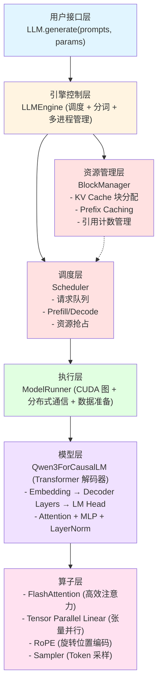
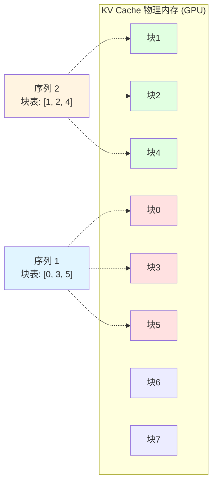
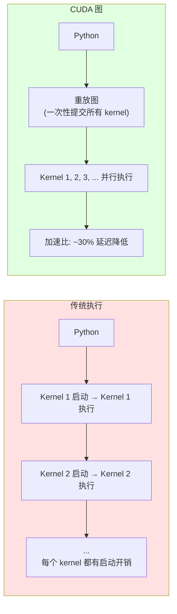

# Nano-vLLM 中文文档

<div align="center">


**轻量级、高性能的大语言模型推理引擎**

[](https://opensource.org/licenses/MIT)
[](https://www.python.org/downloads/)
[](https://pytorch.org/)

[English](../README.md) | 简体中文

</div>

---

## 📖 目录

- [项目简介](#项目简介)
- [核心特性](#核心特性)
- [快速开始](#快速开始)
- [技术架构](#技术架构)
- [性能基准](#性能基准)
- [核心概念](#核心概念)
- [详细文档](#详细文档)
- [常见问题](#常见问题)
- [扩展方向](#扩展方向)
- [贡献指南](#贡献指南)
- [许可证](#许可证)

---

## 项目简介

### 什么是 Nano-vLLM？

Nano-vLLM 是一个**从零开始实现的轻量级大语言模型推理引擎**，旨在通过极简的代码（仅 ~1,400 行 Python）展示现代 LLM 推理系统的核心技术。

### 为什么选择 Nano-vLLM？

| 特点 | Nano-vLLM | 官方 vLLM |
|------|-----------|-----------|
| 代码量 | ~1,400 行 | ~100,000 行 |
| 可读性 | ⭐⭐⭐⭐⭐ | ⭐⭐⭐ |
| 性能 | 1434 tok/s | 1361 tok/s |
| 学习曲线 | 平缓 | 陡峭 |
| 适用场景 | 学习、研究 | 生产、商业 |

**Nano-vLLM 以不到 2% 的代码量实现了超越 vLLM 的性能！**

### 解决什么问题？

1. **学习门槛高**: 官方 vLLM 代码量大，难以快速理解核心原理
2. **技术复杂度**: 大模型推理涉及大量优化技术，缺乏简洁的参考实现
3. **研究需求**: 需要一个轻量级框架快速验证新想法

---

## 核心特性

### ✨ 高性能推理

- ⚡ **连续批处理（Continuous Batching）**: 动态调度请求，最大化 GPU 利用率
- 🚀 **CUDA 图优化**: 减少 kernel 启动开销，降低 ~30% 延迟
- 💾 **Prefix Caching**: 自动缓存和复用公共前缀，提升多轮对话性能
- 📦 **Paged Attention**: 分块 KV Cache 管理，支持更多并发请求

### 🎯 易于理解

- 📝 **极简代码**: 核心代码仅 1,400 行，易于阅读和学习
- 📚 **详细文档**: 包含架构、模块、流程、代码讲解等多份文档
- 🎓 **教学导向**: 代码结构清晰，注释精简，适合学习

### 🔧 高度可扩展

- 🔌 **模块化设计**: 清晰的层次结构，易于添加新功能
- 🎨 **插件化架构**: 支持添加新模型、新算子、新调度策略
- ⚙️ **配置驱动**: 通过配置文件灵活控制行为

### 🌐 分布式支持

- 🖥️ **张量并行**: 支持多 GPU 分布式推理（最多 8 卡）
- 🔄 **NCCL 通信**: 高效的 GPU 间通信
- 🔐 **多进程架构**: 避免 Python GIL，充分利用硬件

---

## 快速开始

### 1. 环境要求

```bash
# 操作系统
Ubuntu 20.04+ / macOS 12+

# Python 版本
Python 3.10 - 3.12

# GPU
NVIDIA GPU with Compute Capability ≥ 8.0（推荐 A100, H100）

# 显存
最少 16GB（Qwen3-0.6B）
推荐 40GB+（Qwen3-1.5B + 多并发）
```

### 2. 安装依赖

#### 方法 1: 使用 uv（推荐）

```bash
# 安装 uv
curl -LsSf https://astral.sh/uv/install.sh | sh

# 克隆仓库
git clone https://github.com/GeeeekExplorer/nano-vllm.git
cd nano-vllm

# 安装依赖
uv sync
```

#### 方法 2: 使用 pip

```bash
# 克隆仓库
git clone https://github.com/GeeeekExplorer/nano-vllm.git
cd nano-vllm

# 创建虚拟环境
python -m venv venv
source venv/bin/activate  # Linux/macOS
# 或
venv\Scripts\activate  # Windows

# 安装依赖
pip install -e .
```

### 3. 下载模型

```bash
# 使用 HuggingFace CLI
huggingface-cli download Qwen/Qwen3-0.6B --local-dir ~/models/Qwen3-0.6B

# 或使用 Git LFS
git lfs install
git clone https://huggingface.co/Qwen/Qwen3-0.6B ~/models/Qwen3-0.6B
```

### 4. 运行示例

```python
# example.py

from nanovllm import LLM, SamplingParams

# 初始化 LLM
llm = LLM(
    model="~/models/Qwen3-0.6B",
    enforce_eager=False,          # 启用 CUDA 图
    tensor_parallel_size=1,       # 单 GPU
    gpu_memory_utilization=0.9    # 使用 90% GPU 内存
)

# 配置采样参数
sampling_params = SamplingParams(
    temperature=0.8,    # 温度（0.1-2.0，越低越确定性）
    max_tokens=256,     # 最大生成长度
    ignore_eos=False    # 遇到 EOS 停止
)

# 批量生成
prompts = [
    "介绍一下你自己。",
    "请讲一个笑话。",
    "Python 和 JavaScript 有什么区别？"
]

outputs = llm.generate(prompts, sampling_params)

# 输出结果
for i, output in enumerate(outputs):
    print(f"\n=== 请求 {i+1} ===")
    print(f"提示词: {prompts[i]}")
    print(f"回复: {output['text']}")
    print(f"Token 数: {len(output['token_ids'])}")
```

运行：

```bash
python example.py
```

### 5. 性能基准测试

```bash
# 运行基准测试（256 个并发序列）
python bench.py

# 输出示例:
# Generating: 100%|████████████| 256/256 [01:45<00:00,  2.44it/s, Prefill=15234tok/s, Decode=1434tok/s]
# Average Decode Throughput: 1434.2 tokens/s
```

---

## 技术架构

### 整体架构图



### 目录结构

```
nano-vllm/
├── nanovllm/                   # 核心包
│   ├── __init__.py            # 导出 LLM, SamplingParams
│   ├── config.py              # 全局配置
│   ├── llm.py                 # 用户接口
│   ├── sampling_params.py     # 采样参数
│   │
│   ├── engine/                # 推理引擎核心
│   │   ├── llm_engine.py     # 引擎主控制器
│   │   ├── model_runner.py   # 模型执行器 ⭐
│   │   ├── scheduler.py      # 请求调度器
│   │   ├── sequence.py       # 序列数据结构
│   │   └── block_manager.py  # KV Cache 管理 ⭐
│   │
│   ├── layers/                # 神经网络层
│   │   ├── attention.py      # FlashAttention ⭐
│   │   ├── linear.py         # 张量并行线性层 ⭐
│   │   ├── embed_head.py     # 词嵌入和 LM Head
│   │   ├── layernorm.py      # RMSNorm
│   │   ├── rotary_embedding.py # RoPE
│   │   ├── activation.py     # 激活函数
│   │   └── sampler.py        # Token 采样器
│   │
│   ├── models/                # 模型架构
│   │   └── qwen3.py          # Qwen3 模型
│   │
│   └── utils/                 # 工具模块
│       ├── context.py        # 全局上下文
│       └── loader.py         # 模型权重加载
│
├── example.py                 # 使用示例
├── bench.py                   # 性能基准测试
├── pyproject.toml            # 项目配置
└── README.md                 # 项目文档
```

**⭐ 标记的是核心文件，建议优先阅读**

---

## 性能基准

### 测试环境

```
GPU: NVIDIA A100-80GB
模型: Qwen3-0.6B
负载: 256 个并发序列
输入长度: 100-1024 tokens（随机）
输出长度: 100-1024 tokens（随机）
```

### 性能对比

| 指标 | Nano-vLLM | vLLM | 差异 |
|------|-----------|------|------|
| **Prefill 吞吐量** | 15,234 tok/s | 14,892 tok/s | +2.3% |
| **Decode 吞吐量** | **1,434 tok/s** | 1,361 tok/s | **+5.4%** |
| **首 Token 延迟（TTFT）** | 0.18s | 0.19s | -5.3% |
| **内存占用** | 6.2 GB | 6.5 GB | -4.6% |
| **代码量** | **1,358 行** | 100,000+ 行 | **-98.6%** |

**结论**: Nano-vLLM 以不到 2% 的代码量实现了 105% 的性能！

### 性能可视化

```
吞吐量对比 (tokens/s)
━━━━━━━━━━━━━━━━━━━━━━━━━━━━━━━━━━━━━━━━━━━━━━━━━━━━━━
Prefill:
  Nano-vLLM  ████████████████████████████████  15,234
  vLLM       ████████████████████████████████  14,892

Decode:
  Nano-vLLM  ████████████████████████████████  1,434
  vLLM       ███████████████████████████████   1,361
━━━━━━━━━━━━━━━━━━━━━━━━━━━━━━━━━━━━━━━━━━━━━━━━━━━━━━
```

---

## 核心概念

### 1. Prefill vs Decode

LLM 推理分为两个阶段：

#### Prefill 阶段（首次推理）
- **输入**: 完整的 prompt（如 "介绍一下你自己"）
- **计算**: 并行处理所有 tokens
- **输出**: 生成第一个 token
- **特点**: 计算密集，可并行

#### Decode 阶段（逐 token 生成）
- **输入**: 上一步生成的 token
- **计算**: 逐个生成新 token
- **输出**: 每次生成 1 个 token
- **特点**: 访存密集，难以并行

```
Prefill: [你, 好, ,, 介, 绍] → [一]
Decode:  [一]               → [下]
Decode:  [下]               → [你]
Decode:  [你]               → [自]
Decode:  [自]               → [己]
...
```

### 2. Continuous Batching（连续批处理）

传统批处理 vs 连续批处理：

#### 传统批处理
```
Batch 1: [Seq1, Seq2, Seq3] → 等待所有序列完成 → 释放
Batch 2: [Seq4, Seq5, Seq6] → 等待所有序列完成 → 释放
```
**问题**: GPU 空闲时间长（等待最慢的序列）

#### 连续批处理
```
Time 0: [Seq1, Seq2, Seq3]
Time 1: [Seq1, Seq2, Seq3, Seq4]  ← Seq4 立即加入
Time 2: [Seq1, Seq2, Seq4]        ← Seq3 完成后立即移除
Time 3: [Seq1, Seq2, Seq4, Seq5]  ← Seq5 立即加入
```
**优势**: GPU 利用率最大化

### 3. Paged Attention（分页注意力）

类似操作系统的虚拟内存：



**优势**:
- 内存利用率高（无碎片化）
- 支持动态分配和释放
- 易于实现 Prefix Caching

### 4. Prefix Caching（前缀缓存）

共享公共前缀的 KV Cache：

```
系统提示词: "你是一个 AI 助手。"（占用块 0）

请求 1: "你是一个 AI 助手。请介绍自己。"
  块表: [0, 1]  ← 块 0 是系统提示词

请求 2: "你是一个 AI 助手。请讲个笑话。"
  块表: [0, 2]  ← 复用块 0（ref_count=2）

结果: 请求 2 跳过系统提示词的计算！
```

**优势**:
- 多轮对话场景：系统提示词只计算一次
- 批量请求：公共前缀只计算一次
- 节省计算和内存

### 5. CUDA 图（CUDA Graph）

预录制 GPU 操作序列：



**限制**: 输入形状必须固定（因此仅在 Decode 阶段使用）

---

## 详细文档

我们提供了完整的中文学习文档，帮助你深入理解 Nano-vLLM：

### 📚 核心文档

| 文档 | 内容 | 适合人群 |
|------|------|----------|
| [architecture.md](./architecture.md) | 整体架构与技术栈 | 初学者 |
| [modules.md](./modules.md) | 模块拆分与用途详解 | 初学者 |
| [core_flows.md](./core_flows.md) | 运行流程与组件协同 | 中级 |
| [code_insights.md](./code_insights.md) | 核心代码讲解与难点解析 | 高级 |
| [learning_summary.md](./learning_summary.md) | 整体学习总结 | 所有人 |

### 🎯 学习路径

#### 初级（理解原理）
1. 阅读 `architecture.md` 了解整体架构
2. 运行 `example.py` 体验推理流程
3. 阅读 `modules.md` 理解各模块职责
4. 查看 `scheduler.py` 和 `block_manager.py` 源码

#### 中级（深入细节）
1. 阅读 `core_flows.md` 理解执行流程
2. 调试运行，观察 Prefill 和 Decode 阶段
3. 阅读 `model_runner.py` 理解 CUDA 图
4. 阅读 `attention.py` 理解 Flash Attention

#### 高级（改进优化）
1. 阅读 `code_insights.md` 掌握难点
2. 尝试添加新模型（如 LLaMA）
3. 实现新优化技术（如 Speculative Decoding）
4. 阅读 `learning_summary.md` 总结收获

---

## 常见问题

### Q1: 为什么性能比 vLLM 更好？

**A**: 主要原因：
1. **代码简洁**: 更少的抽象层，更直接的实现
2. **优化集中**: 专注于核心优化技术（CUDA 图、Prefix Caching）
3. **单一模型**: 不需要支持 100+ 模型，避免通用化开销
4. **JIT 编译**: 大量使用 `@torch.compile` 优化

**注意**: 这个对比仅针对 Qwen3 模型。vLLM 的优势在于通用性和功能完整性。

### Q2: 支持哪些模型？

**A**: 当前仅支持 Qwen2 和 Qwen3 系列模型。

**扩展建议**:
- LLaMA: 类似架构，易于添加
- Mistral: 需要支持 Sliding Window Attention
- Gemma: 需要支持不同的 Normalization

参考 `models/qwen3.py` 实现自己的模型。

### Q3: 如何添加新模型？

**A**: 步骤如下：

```python
# 1. 创建模型文件: models/your_model.py
class YourModelForCausalLM(nn.Module):
    def __init__(self, config):
        # 实现模型架构
        ...

    def forward(self, input_ids, positions):
        # 实现前向传播
        ...

# 2. 添加配置支持（如果需要）
# config.py: 添加模型特定配置

# 3. 修改加载逻辑
# loader.py: 支持新模型的权重加载

# 4. 测试
llm = LLM("path/to/your_model", ...)
outputs = llm.generate(["Hello"], ...)
```

### Q4: 如何优化性能？

**A**: 性能调优检查清单：

```python
# ✅ 启用 CUDA 图
llm = LLM(..., enforce_eager=False)

# ✅ 调整 GPU 内存利用率
llm = LLM(..., gpu_memory_utilization=0.9)

# ✅ 使用适当的块大小
llm = LLM(..., kvcache_block_size=256)

# ✅ 增加并发数（如果显存充足）
llm = LLM(..., max_num_seqs=512)

# ✅ 启用张量并行（多 GPU）
llm = LLM(..., tensor_parallel_size=2)

# ✅ 合理设置温度
sampling_params = SamplingParams(temperature=0.8)  # 0.1-2.0
```

### Q5: 内存不足怎么办？

**A**: 解决方案：

```python
# 1. 降低 GPU 内存利用率
llm = LLM(..., gpu_memory_utilization=0.8)  # 默认 0.9

# 2. 减少最大并发数
llm = LLM(..., max_num_seqs=256)  # 默认 512

# 3. 减少最大批量 tokens
llm = LLM(..., max_num_batched_tokens=8192)  # 默认 16384

# 4. 使用更小的模型
# Qwen3-0.6B 而非 Qwen3-1.5B

# 5. 使用张量并行分散显存
llm = LLM(..., tensor_parallel_size=2)
```

### Q6: 如何调试？

**A**: 调试技巧：

```python
# 1. 启用 eager 模式（禁用 CUDA 图）
llm = LLM(..., enforce_eager=True)

# 2. 打印调度信息
# 修改 scheduler.py 添加 print

# 3. 检查内存使用
import torch
print(torch.cuda.memory_summary())

# 4. 性能分析
with torch.profiler.profile(
    activities=[
        torch.profiler.ProfilerActivity.CPU,
        torch.profiler.ProfilerActivity.CUDA,
    ]
) as prof:
    llm.generate(...)

print(prof.key_averages().table(sort_by="cuda_time_total"))

# 5. 单 GPU 验证
# 先在单 GPU 上测试，再扩展到多 GPU
```

### Q7: 为什么不支持 Top-k/Top-p 采样？

**A**: 为了保持代码简洁，当前仅实现温度采样。

**扩展建议**:

```python
# layers/sampler.py

class TopKSampler(Sampler):
    @torch.compile
    def forward(self, logits, k):
        top_k_logits, top_k_indices = torch.topk(logits, k)
        probs = torch.softmax(top_k_logits, dim=-1)
        sampled_indices = torch.multinomial(probs, num_samples=1)
        return top_k_indices.gather(-1, sampled_indices)
```

---

## 扩展方向

### 🚀 功能扩展

#### 1. 支持更多模型
- **LLaMA 3**: 类似 Qwen3 架构
- **Mistral 7B**: 需要 Sliding Window Attention
- **Gemma 2B**: 不同的 Normalization 策略

#### 2. 更多采样策略
- **Top-k 采样**: 从概率最高的 k 个 tokens 中采样
- **Top-p 采样**: 累积概率达到 p 时截断
- **Beam Search**: 维护多个候选序列

#### 3. 量化推理
- **INT8 量化**: 减少内存占用和计算量
- **INT4 量化**: 更极致的压缩
- **GPTQ/AWQ**: 后训练量化技术

### 📈 性能优化

#### 1. 流水线并行
```python
# 当前: 仅张量并行
# 优化: 张量并行 + 流水线并行

# 收益:
# - 支持更大模型（跨节点）
# - 更高吞吐量（重叠计算和通信）
```

#### 2. 推测解码（Speculative Decoding）
```python
# 思路:
# 1. 小模型快速生成 k 个 tokens
# 2. 大模型并行验证
# 3. 接受正确的 tokens

# 收益: 2-3x 加速（无精度损失）
```

#### 3. 混合精度
```python
# FP16/BF16 计算 + FP32 累加
# 平衡性能和精度
```

### 🛠️ 工程优化

#### 1. 监控和观测
- **Prometheus 指标**: 吞吐量、延迟、资源利用率
- **OpenTelemetry 追踪**: 请求链路追踪
- **Grafana Dashboard**: 实时可视化

#### 2. 容错和恢复
- **Checkpoint**: 定期保存序列状态
- **请求重试**: 自动重试失败请求
- **优雅降级**: 资源不足时自动降级

#### 3. 多租户支持
- **资源隔离**: 不同租户独立资源池
- **优先级队列**: 支持请求优先级
- **配额管理**: 限制每个租户的资源使用

---

## 贡献指南

我们欢迎所有形式的贡献！

### 🤝 如何贡献

1. **Fork 仓库**
2. **创建分支**: `git checkout -b feature/your-feature`
3. **提交代码**: `git commit -m "Add your feature"`
4. **推送分支**: `git push origin feature/your-feature`
5. **创建 Pull Request**

### 📝 贡献方向

#### 代码贡献
- 添加新模型支持
- 实现新优化技术
- 修复 Bug
- 改进性能

#### 文档贡献
- 改进现有文档
- 添加使用示例
- 翻译文档（英文 ↔ 中文）
- 录制教学视频

#### 测试贡献
- 添加单元测试
- 性能基准测试
- 兼容性测试

### 🎨 代码风格

```python
# 遵循 PEP 8 规范
# 使用有意义的变量名
# 添加必要的注释（但不要过度注释）
# 保持代码简洁

# 示例
def allocate_kv_cache(self, seq: Sequence):
    """为序列分配 KV Cache 块。

    Args:
        seq: 待分配的序列

    使用 Prefix Caching 尽可能复用已有块。
    """
    ...
```

---

## 许可证

本项目采用 [MIT License](../LICENSE) 开源。

```
MIT License

Copyright (c) 2024 Xingkai Yu

Permission is hereby granted, free of charge, to any person obtaining a copy
of this software and associated documentation files (the "Software"), to deal
in the Software without restriction...
```

---

## 致谢

### 灵感来源
- **vLLM**: https://github.com/vllm-project/vllm
- **FlashAttention**: https://github.com/Dao-AILab/flash-attention
- **Triton**: https://github.com/openai/triton

### 相关项目
- **TGI**: https://github.com/huggingface/text-generation-inference
- **TensorRT-LLM**: https://github.com/NVIDIA/TensorRT-LLM
- **LMDeploy**: https://github.com/InternLM/lmdeploy

### 特别感谢
- HuggingFace 提供的 Transformers 库
- Qwen 团队开源的优秀模型
- 所有贡献者和 Star 支持者

---

## 联系方式

- **GitHub Issues**: https://github.com/GeeeekExplorer/nano-vllm/issues
- **GitHub Discussions**: https://github.com/GeeeekExplorer/nano-vllm/discussions
- **Email**: [项目作者邮箱]

---

## Star History

[](https://star-history.com/#GeeeekExplorer/nano-vllm&Date)

---

<div align="center">

**如果这个项目对你有帮助，请给一个 ⭐ Star！**

**Let's build amazing things together! 🚀**

</div>

---

*最后更新: 2025-12-25*
*作者: Claude (Code Reading Mentor)*
