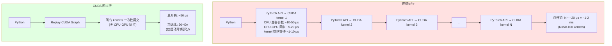

# Nano-vLLM 核心代码讲解与难点解析

## 目录
1. [Prefix Caching 实现深度解析](#prefix-caching-实现深度解析)
2. [CUDA 图捕获和重放机制](#cuda-图捕获和重放机制)
3. [Flash Attention 集成原理](#flash-attention-集成原理)
4. [张量并行的权重切分策略](#张量并行的权重切分策略)
5. [多进程共享内存通信](#多进程共享内存通信)
6. [调度器的资源抢占算法](#调度器的资源抢占算法)
7. [torch.compile 优化技巧](#torchcompile-优化技巧)
8. [Triton 自定义内核实现](#triton-自定义内核实现)
9. [KV Cache 内存布局优化](#kv-cache-内存布局优化)
10. [难点总结与最佳实践](#难点总结与最佳实践)

---

## Prefix Caching 实现深度解析

### 1. 核心思想

Prefix Caching 通过**哈希共享**实现 KV Cache 块的复用：
- 相同的 token 序列 → 相同的哈希值 → 共享 KV Cache 块
- 引用计数管理，避免重复计算

### 2. 关键代码解析

#### 2.1 增量哈希计算

```python
# block_manager.py:36-41

@classmethod
def compute_hash(cls, token_ids: list[int], prefix: int = -1):
    h = xxhash.xxh64()
    if prefix != -1:
        h.update(prefix.to_bytes(8, "little"))  # 累积前一个块的哈希
    h.update(np.array(token_ids).tobytes())
    return h.intdigest()
```

**为什么需要 prefix？**
- 确保哈希的唯一性和顺序性
- 例如：`[1,2]` 后跟 `[3,4]` 的哈希 ≠ `[3,4]` 后跟 `[1,2]` 的哈希

**增量哈希示例**:
```
序列: [1, 2, 3, 4, 5, 6, 7, 8]
块大小: 4

块 0: [1,2,3,4]
  h0 = hash([1,2,3,4], prefix=-1)
  = xxhash([1,2,3,4])

块 1: [5,6,7,8]
  h1 = hash([5,6,7,8], prefix=h0)
  = xxhash(h0 || [5,6,7,8])

优势: h1 包含了整个序列的信息，但只需计算新块
```

#### 2.2 块分配与哈希查找

```python
# block_manager.py:59-83（简化版）

def allocate(self, seq: Sequence):
    h = -1
    cache_miss = False
    for i in range(seq.num_blocks):
        token_ids = seq.block(i)

        # 1. 计算哈希（仅完整块）
        if len(token_ids) == self.block_size:
            h = self.compute_hash(token_ids, h)
        else:
            h = -1  # 不完整的块不参与缓存

        # 2. 查找哈希表
        block_id = self.hash_to_block_id.get(h, -1)

        # 3. 验证哈希（防止碰撞）
        if block_id != -1 and self.blocks[block_id].token_ids != token_ids:
            block_id = -1  # 哈希碰撞，当作未命中

        # 4. 处理缓存命中/未命中
        if block_id != -1 and not cache_miss:
            # 缓存命中！
            if block_id in self.used_block_ids:
                # 块正在使用，增加引用计数
                self.blocks[block_id].ref_count += 1
            else:
                # 块已释放但哈希仍在表中，重新分配
                self._allocate_block(block_id)
            seq.num_cached_tokens += self.block_size
        else:
            # 缓存未命中
            cache_miss = True
            block_id = self.free_block_ids[0]
            self._allocate_block(block_id)

        # 5. 更新哈希表
        if h != -1:
            self.blocks[block_id].update(h, token_ids)
            self.hash_to_block_id[h] = block_id

        seq.block_table.append(block_id)
```

**关键设计点**:

1. **哈希碰撞检测**:
   ```python
   # 不仅检查哈希值，还验证实际 token IDs
   if self.blocks[block_id].token_ids != token_ids:
       # 碰撞！当作未命中处理
   ```

2. **cache_miss 标志**:
   ```python
   # 一旦有一个块未命中，后续块全部分配新块
   # 原因：Prefix Caching 要求前缀连续
   if cache_miss:
       # 即使哈希命中，也分配新块
   ```

3. **引用计数 Copy-on-Write**:
   ```python
   # ref_count = 1: 独占块，可以修改
   # ref_count > 1: 共享块，只读
   # 如果需要修改共享块，先复制
   ```

### 3. 完整案例分析

**场景**: 两个请求共享系统提示词

```python
# 系统提示词（共享）
system_prompt = "你是一个AI助手。"  # tokens: [100, 101, 102, ..., 115] (16 tokens)

# 请求 1
req1 = system_prompt + "请介绍自己。"  # tokens: [...115, 200, 201, 202]

# 请求 2
req2 = system_prompt + "请讲个笑话。"  # tokens: [...115, 300, 301, 302]

# 块大小 = 16
```

**执行过程**:

```
【请求 1 分配】
块 0: [100,101,...,115]  # 系统提示词
  h0 = hash([100,101,...,115], prefix=-1) = 0xABCD1234
  hash_to_block_id[0xABCD1234] = 5
  blocks[5].ref_count = 1
  blocks[5].token_ids = [100,101,...,115]
  seq1.block_table = [5]

块 1: [200,201,202,...]  # 不完整块
  h1 = -1（不缓存）
  分配新块 6
  seq1.block_table = [5, 6]

【请求 2 分配】
块 0: [100,101,...,115]  # 系统提示词（相同！）
  h0 = hash([100,101,...,115], prefix=-1) = 0xABCD1234
  查找 hash_to_block_id[0xABCD1234] → 5
  验证 blocks[5].token_ids == [100,101,...,115] ✓
  缓存命中！
  blocks[5].ref_count = 2  # 增加引用计数
  seq2.num_cached_tokens = 16  # 跳过这 16 个 tokens 的计算
  seq2.block_table = [5]

块 1: [300,301,302,...]  # 不同内容
  h1 = -1
  分配新块 7
  seq2.block_table = [5, 7]

【结果】
- 块 5 被两个序列共享（ref_count=2）
- 请求 2 跳过了系统提示词的前向传播
- 节省了 ~50% 的计算量（假设提示词占一半）
```

### 4. 性能影响

**优势**:
- 多轮对话场景：系统提示词只计算一次
- 批量请求：公共前缀只计算一次
- 减少内存占用：共享 KV Cache 块

**开销**:
- 哈希计算：xxhash 非常快（~GB/s）
- 哈希表查找：O(1)
- 总开销：< 1% 的推理时间

**实际案例**:
```
场景: 100 个请求，共享 1000 token 的系统提示词

无 Prefix Caching:
  - 计算次数: 100 * 1000 = 100,000 tokens
  - 内存占用: 100 个块表

有 Prefix Caching:
  - 计算次数: 1 * 1000 = 1,000 tokens（首次）
  - 内存占用: 1 个共享块表
  - 加速比: 100x（Prefill 阶段）
```

---

## CUDA 图捕获和重放机制

### 1. 核心原理

CUDA 图（CUDA Graph）是一种**预先录制 GPU 操作序列**的机制：
- 捕获阶段：录制所有 kernel 调用
- 重放阶段：一次性提交所有 kernel（无 CPU-GPU 同步）

### 2. 关键代码解析

#### 2.1 捕获流程

```python
# model_runner.py:194-229（简化版）

def capture_cudagraph(self):
    self.graphs = {}
    for num_seqs in [1, 2, 4, 8, 16, ..., 512]:
        # 1. 准备固定大小的输入缓冲区
        input_ids = torch.zeros(num_seqs, dtype=torch.long, device="cuda")
        positions = torch.zeros(num_seqs, dtype=torch.long, device="cuda")
        slot_mapping = torch.zeros(num_seqs, dtype=torch.long, device="cuda")
        # ... 其他输入

        # 2. 准备固定大小的输出缓冲区
        logits = torch.zeros(num_seqs, vocab_size, dtype=torch.float16, device="cuda")

        # 3. 预热（避免 lazy initialization）
        for _ in range(3):
            logits = self.model.forward(input_ids, positions)

        # 4. 创建 CUDA 图
        graph = torch.cuda.CUDAGraph()

        # 5. 捕获前向传播
        with torch.cuda.graph(graph):
            logits = self.model.forward(
                input_ids, positions,
                cu_seqlens_q=cu_seqlens_q,
                # ... 其他参数
            )

        # 6. 存储图和缓冲区
        self.graphs[num_seqs] = {
            "graph": graph,
            "input_ids": input_ids,
            "positions": positions,
            "slot_mapping": slot_mapping,
            "logits": logits,
            # ...
        }
```

**关键点**:

1. **固定输入形状**:
   ```python
   # 捕获时的 batch_size 必须与重放时一致
   input_ids = torch.zeros(num_seqs, ...)  # 固定形状
   ```

2. **预热（Warmup）**:
   ```python
   # 避免首次执行时的 lazy initialization
   for _ in range(3):
       self.model.forward(...)
   ```

3. **捕获上下文**:
   ```python
   with torch.cuda.graph(graph):
       # 在这个上下文中的所有 CUDA 操作都会被录制
       output = model.forward(input)
   ```

#### 2.2 重放流程

```python
# model_runner.py（简化版）

def run_cudagraph(self, seqs):
    num_seqs = len(seqs)
    graph_pool = self.graphs[num_seqs]

    # 1. 拷贝实际输入到固定缓冲区
    actual_input_ids = torch.tensor([seq[-1] for seq in seqs])
    graph_pool["input_ids"].copy_(actual_input_ids)

    # 同样拷贝其他输入...

    # 2. 重放 CUDA 图
    graph_pool["graph"].replay()

    # 3. 从固定缓冲区读取输出
    logits = graph_pool["logits"].clone()

    return logits
```

**为什么需要 copy？**
- CUDA 图要求使用固定的内存地址
- 实际输入每次不同，但必须拷贝到固定缓冲区
- 拷贝开销 << kernel 启动开销

### 3. 性能对比

**传统执行 vs CUDA 图执行对比**:



### 4. 限制与权衡

**限制**:
1. **固定输入形状**: 不支持动态 batch size
   ```python
   # 只能捕获固定 batch sizes
   supported_sizes = [1, 2, 4, 8, ..., 512]
   ```

2. **内存占用**: 每个 batch size 需要独立的缓冲区
   ```python
   # 10 个 batch sizes × 2GB 缓冲区 = 20GB 额外内存
   ```

3. **不支持控制流**: if/while 等动态控制流会破坏图
   ```python
   # ❌ 不能在图中使用
   if some_condition:
       output = path_a(input)
   else:
       output = path_b(input)
   ```

**权衡**:
```python
# model_runner.py

if !self.enforce_eager and num_seqs in self.graphs:
    # 使用 CUDA 图（更快，但内存大）
    logits = self.run_cudagraph(seqs)
else:
    # 直接前向传播（更灵活，但慢）
    logits = self.model.forward(...)
```

### 5. 最佳实践

```python
# 1. 仅在 Decode 阶段使用 CUDA 图
# Prefill 阶段输入形状变化太大，不适合

# 2. 限制捕获的 batch sizes
# 避免内存爆炸
max_batch_size = 512

# 3. 预热足够次数
# 确保所有 lazy allocation 完成
warmup_iterations = 3

# 4. 使用 pin_memory 加速拷贝
input_ids = torch.zeros(..., pin_memory=True)
```

---

## Flash Attention 集成原理

### 1. 核心优势

Flash Attention 通过**分块计算**和 **IO 优化**减少内存占用：
- 标准 Attention: O(N²) 内存（显式构造注意力矩阵）
- Flash Attention: O(N) 内存（on-the-fly 计算）

### 2. 关键代码解析

#### 2.1 Triton KV Cache 存储内核

```python
# attention.py:10-30

@triton.jit
def store_kvcache_kernel(
    key_ptr, key_stride,
    value_ptr, value_stride,
    k_cache_ptr, v_cache_ptr,
    slot_mapping_ptr,
    D: tl.constexpr,  # 常量：num_heads * head_dim
):
    # 1. 获取当前线程处理的 token 索引
    idx = tl.program_id(0)

    # 2. 从 slot_mapping 读取目标 slot
    slot = tl.load(slot_mapping_ptr + idx)
    if slot == -1:
        return  # 无效 slot，跳过

    # 3. 读取 key/value（从连续内存）
    key_offsets = idx * key_stride + tl.arange(0, D)
    value_offsets = idx * value_stride + tl.arange(0, D)
    key = tl.load(key_ptr + key_offsets)
    value = tl.load(value_ptr + value_offsets)

    # 4. 写入 KV Cache（分散写入）
    cache_offsets = slot * D + tl.arange(0, D)
    tl.store(k_cache_ptr + cache_offsets, key)
    tl.store(v_cache_ptr + cache_offsets, value)
```

**为什么使用 Triton？**
- PyTorch 原生操作需要两次 kernel 调用（index + copy）
- Triton 融合为一个 kernel，减少 50% 的内存访问

**Slot Mapping 示例**:
```python
# 输入
key.shape = [5, 16, 128]     # [num_tokens, num_heads, head_dim]
slot_mapping = [10, 11, -1, 15, 16]

# 执行
线程 0: key[0] → k_cache[slot=10]  # 写入 slot 10
线程 1: key[1] → k_cache[slot=11]
线程 2: skip（slot=-1）
线程 3: key[3] → k_cache[slot=15]
线程 4: key[4] → k_cache[slot=16]
```

#### 2.2 Prefill 阶段 Flash Attention

```python
# attention.py:64-70

if context.is_prefill:
    if context.block_tables is not None:  # 有 Prefix Cache
        k, v = k_cache, v_cache  # 从 Cache 读取

    o = flash_attn_varlen_func(
        q, k, v,
        max_seqlen_q=context.max_seqlen_q,   # 最大查询长度
        cu_seqlens_q=context.cu_seqlens_q,   # 累积序列长度（Query）
        max_seqlen_k=context.max_seqlen_k,   # 最大键长度
        cu_seqlens_k=context.cu_seqlens_k,   # 累积序列长度（Key）
        softmax_scale=self.scale,            # 1 / sqrt(head_dim)
        causal=True,                          # 因果掩码
        block_table=context.block_tables      # Paged Attention 支持
    )
```

**变长序列批处理（varlen）**:

```python
# 两个序列: seq1 长度 5, seq2 长度 3
q = torch.cat([q1, q2], dim=0)  # shape: [8, num_heads, head_dim]

# 累积序列长度
cu_seqlens_q = [0, 5, 8]  # 序列边界
# seq1: q[0:5]
# seq2: q[5:8]

# Flash Attention 内部会自动处理边界
# 避免了 padding 带来的浪费计算
```

**Paged Attention（block_table）**:

```python
# 序列的 KV Cache 可能不连续
seq.block_table = [5, 12, 7]  # 分布在块 5, 12, 7

# Flash Attention 通过 block_table 查找 KV Cache
# 无需将 KV 拷贝到连续内存
```

#### 2.3 Decode 阶段 Flash Attention

```python
# attention.py:71-75

else:  # Decode 阶段
    o = flash_attn_with_kvcache(
        q.unsqueeze(1),              # [batch, 1, num_heads, head_dim]
        k_cache, v_cache,            # 完整的 KV Cache
        cache_seqlens=context.context_lens,  # 每个序列的上下文长度
        block_table=context.block_tables,    # 块表
        softmax_scale=self.scale,
        causal=True
    )
```

**与 Prefill 的区别**:
- Prefill: 查询长度不定，键值长度不定（变长批处理）
- Decode: 查询长度固定为 1，键值从 Cache 读取

**Decode 示例**:
```python
# 3 个序列正在 Decode
q.shape = [3, 1, 16, 128]  # [batch, 1, num_heads, head_dim]

cache_seqlens = [10, 5, 8]  # 每个序列的上下文长度
block_tables = [
    [0, 1, -1],    # seq1: 块 0,1
    [2, -1, -1],   # seq2: 块 2
    [3, 4, -1]     # seq3: 块 3,4
]

# Flash Attention 自动处理:
# seq1: q[0] attend to k_cache[块0,块1][:10]
# seq2: q[1] attend to k_cache[块2][:5]
# seq3: q[2] attend to k_cache[块3,块4][:8]
```

### 3. 内存与性能对比

```
【标准 Attention】
序列长度 N = 4096, 批量大小 B = 32, 头数 H = 16

1. 计算 QK^T: [B, H, N, N]
   内存: 32 * 16 * 4096 * 4096 * 2 bytes = 16 GB

2. Softmax
3. 乘以 V

总内存: O(B * H * N^2) = 16 GB

【Flash Attention】
分块大小 M = 256

1. 每次只计算 [B, H, M, M] 的子块
   内存: 32 * 16 * 256 * 256 * 2 bytes = 64 MB

2. 循环处理所有子块

总内存: O(B * H * N) = 64 MB

内存节省: 250x
速度: 2-4x（IO 优化）
```

---

## 张量并行的权重切分策略

### 1. 核心原则

张量并行将**权重矩阵**切分到多个 GPU：
- 列切分（Column Parallel）: 输出维度切分
- 行切分（Row Parallel）: 输入维度切分

### 2. 关键代码解析

#### 2.1 列切分（ColumnParallelLinear）

```python
# linear.py:54-73

class ColumnParallelLinear(LinearBase):
    def __init__(self, input_size, output_size, bias=False):
        tp_size = dist.get_world_size()
        # 权重形状: [output_size/tp_size, input_size]
        super().__init__(input_size, divide(output_size, tp_size), bias, tp_dim=0)

    def weight_loader(self, param, loaded_weight):
        # 从完整权重中切片
        param_data = param.data
        shard_size = param_data.size(self.tp_dim)  # output_size / tp_size
        start_idx = self.tp_rank * shard_size
        loaded_weight = loaded_weight.narrow(self.tp_dim, start_idx, shard_size)
        param_data.copy_(loaded_weight)

    def forward(self, x):
        return F.linear(x, self.weight, self.bias)
        # 输入: [batch, seq, input_size]
        # 输出: [batch, seq, output_size/tp_size]
        # 无需通信！
```

**示例**:
```python
# 完整权重: [14336, 4096]
# TP size = 2

GPU 0:
  weight: [7168, 4096]  # 前半部分输出维度
  input: [batch, seq, 4096]
  output: [batch, seq, 7168]

GPU 1:
  weight: [7168, 4096]  # 后半部分输出维度
  input: [batch, seq, 4096]（相同）
  output: [batch, seq, 7168]

后续层会拼接或使用 RowParallelLinear
```

#### 2.2 行切分（RowParallelLinear）

```python
# linear.py:104-120

class RowParallelLinear(LinearBase):
    def __init__(self, input_size, output_size, bias=False):
        tp_size = dist.get_world_size()
        # 权重形状: [output_size, input_size/tp_size]
        super().__init__(divide(input_size, tp_size), output_size, bias, tp_dim=1)

    def weight_loader(self, param, loaded_weight):
        # 从完整权重中切片
        shard_size = param.size(self.tp_dim)
        start_idx = self.tp_rank * shard_size
        loaded_weight = loaded_weight.narrow(self.tp_dim, start_idx, shard_size)
        param.data.copy_(loaded_weight)

    def forward(self, x):
        output = F.linear(x, self.weight, self.bias)
        # All-Reduce: 跨 GPU 求和
        dist.all_reduce(output, op=dist.ReduceOp.SUM)
        return output
```

**示例**:
```python
# 完整权重: [4096, 14336]
# TP size = 2

GPU 0:
  weight: [4096, 7168]  # 前半部分输入维度
  input: [batch, seq, 7168]  # 仅使用前半部分
  local_output: [batch, seq, 4096]

GPU 1:
  weight: [4096, 7168]  # 后半部分输入维度
  input: [batch, seq, 7168]  # 仅使用后半部分
  local_output: [batch, seq, 4096]

All-Reduce:
  output = GPU0_output + GPU1_output
  output.shape = [batch, seq, 4096]
```

#### 2.3 QKV 并行（QKVParallelLinear）

```python
# linear.py:76-102（简化版）

class QKVParallelLinear(ColumnParallelLinear):
    def __init__(self, hidden_size, head_dim, num_heads, num_kv_heads, bias=False):
        tp_size = dist.get_world_size()

        # 每个 GPU 分配的头数
        self.num_heads_per_gpu = num_heads // tp_size
        self.num_kv_heads_per_gpu = num_kv_heads // tp_size

        # 总输出维度: (Q + K + V) * head_dim
        total_output_size = (num_heads + 2 * num_kv_heads) * head_dim

        super().__init__(hidden_size, total_output_size, bias)

    def weight_loader(self, param, loaded_weight):
        # Q, K, V 权重需要分别切片
        q_weight, k_weight, v_weight = loaded_weight.split([
            self.num_heads * self.head_dim,
            self.num_kv_heads * self.head_dim,
            self.num_kv_heads * self.head_dim
        ], dim=0)

        # 每个 GPU 切片对应的头
        start_head = self.tp_rank * self.num_heads_per_gpu

        q_shard = q_weight[start_head * head_dim : ...]
        k_shard = k_weight[start_kv_head * head_dim : ...]
        v_shard = v_weight[start_kv_head * head_dim : ...]

        param.data.copy_(torch.cat([q_shard, k_shard, v_shard], dim=0))
```

**示例**:
```python
# Qwen3: 16 个 Q 头, 2 个 KV 头, head_dim=128
# 完整权重: [(16+2+2)*128, 4096] = [2560, 4096]
# TP size = 2

GPU 0:
  Q 权重: [8*128, 4096]   # 前 8 个 Q 头
  K 权重: [1*128, 4096]   # 前 1 个 KV 头
  V 权重: [1*128, 4096]
  总权重: [1280, 4096]

  输出: [batch, seq, 1280]
  split → Q: [batch, seq, 1024], K: [batch, seq, 128], V: [batch, seq, 128]

GPU 1:
  Q 权重: [8*128, 4096]   # 后 8 个 Q 头
  K 权重: [1*128, 4096]   # 后 1 个 KV 头
  V 权重: [1*128, 4096]
  总权重: [1280, 4096]
```

### 3. 通信模式总结

```
层类型                  前向传播通信      参数切分
──────────────────────────────────────────────────
VocabParallelEmbedding  All-Reduce       词表按 vocab_size 切分
ColumnParallelLinear    无               输出维度切分
RowParallelLinear       All-Reduce       输入维度切分
QKVParallelLinear       无               头数切分
ParallelLMHead          无               词表按 vocab_size 切分

每层通信次数: 0-2 次 All-Reduce
每个 Transformer 层: 2 次 All-Reduce (O 投影 + MLP Down 投影)
```

---

## 多进程共享内存通信

### 1. 核心设计

主进程通过共享内存向子进程传递**方法调用**：
- 主进程：写入方法名和参数（pickle 序列化）
- 子进程：读取并执行相同的方法
- 同步：使用 `multiprocessing.Event`

### 2. 关键代码解析

#### 2.1 共享内存初始化

```python
# model_runner.py:41-48

if self.world_size > 1:
    if rank == 0:
        # 主进程创建共享内存
        self.shm = SharedMemory(name="nanovllm", create=True, size=2**20)  # 1MB
        dist.barrier()  # 等待所有进程初始化完成
    else:
        # 子进程连接到共享内存
        dist.barrier()
        self.shm = SharedMemory(name="nanovllm")
        self.loop()  # 子进程进入监听循环
```

**为什么 1MB 足够？**
- 仅传递方法名和少量标量参数
- 大张量（如 input_ids）通过 NCCL 传递（更高效）

#### 2.2 主进程写入

```python
# model_runner.py:76-83

def write_shm(self, method_name, *args):
    assert self.world_size > 1 and self.rank == 0

    # 1. 序列化方法名和参数
    data = pickle.dumps([method_name, *args])
    n = len(data)

    # 2. 写入共享内存
    self.shm.buf[0:4] = n.to_bytes(4, "little")  # 前 4 字节存储数据长度
    self.shm.buf[4:n+4] = data                    # 实际数据

    # 3. 通知所有子进程
    for event in self.event:
        event.set()  # 触发 Event
```

**内存布局**:

共享内存 (1MB):

| 字节范围 | 内容 |
|---------|------|
| 0-3     | 数据长度 (4 bytes, little-endian) |
| 4-N+3   | pickle 序列化数据 |

#### 2.3 子进程读取

```python
# model_runner.py:68-74

def read_shm(self):
    assert self.world_size > 1 and self.rank > 0

    # 1. 等待主进程信号
    self.event.wait()  # 阻塞直到 event.set()

    # 2. 从共享内存读取
    n = int.from_bytes(self.shm.buf[0:4], "little")
    method_name, *args = pickle.loads(self.shm.buf[4:n+4])

    # 3. 清除信号
    self.event.clear()

    return method_name, args

# model_runner.py:61-66

def loop(self):
    while True:
        method_name, args = self.read_shm()
        self.call(method_name, *args)  # 执行方法
        if method_name == "exit":
            break
```

#### 2.4 统一调用接口

```python
# model_runner.py:85-89

def call(self, method_name, *args):
    if self.world_size > 1 and self.rank == 0:
        self.write_shm(method_name, *args)  # 主进程写入

    method = getattr(self, method_name, None)
    return method(*args)  # 所有进程执行
```

**使用示例**:
```python
# 用户调用（仅在主进程）
model_runner.call("run", seqs, is_prefill=True)

# 内部流程:
# 1. 主进程（rank=0）:
#    write_shm("run", seqs, is_prefill=True)
#    self.run(seqs, is_prefill=True)
#
# 2. 子进程（rank=1,2,...）:
#    read_shm() → ("run", [seqs, is_prefill=True])
#    self.run(seqs, is_prefill=True)

# 结果: 所有进程同步执行 run 方法
```

### 3. 同步机制

```
时间轴:

主进程 (rank=0)
    │
    ├─► write_shm("run", seqs, True)
    │   ├─► pickle.dumps([...])
    │   ├─► 写入共享内存
    │   └─► event1.set(), event2.set()
    │
    ├─► self.run(seqs, True)
    │   ├─► 前向传播
    │   └─► NCCL All-Reduce
    │
    └─► 返回结果

子进程 (rank=1,2,...)
    │
    ├─► event.wait() ──────────► 阻塞中 ──────────► event.set() 触发
    │
    ├─► read_shm() → ("run", [seqs, True])
    │
    ├─► event.clear()
    │
    ├─► self.run(seqs, True)
    │   ├─► 前向传播（相同参数）
    │   └─► NCCL All-Reduce
    │
    └─► 继续 loop()

NCCL 同步点:
    所有进程在 All-Reduce 处自动同步
```

### 4. 为什么不传递张量？

```python
# ❌ 不推荐：通过共享内存传递张量
data = pickle.dumps(large_tensor)  # 可能 > 1GB
shm.buf[...] = data  # 拷贝到共享内存
# 问题: 拷贝开销大，共享内存空间有限

# ✅ 推荐：通过 NCCL 传递张量
# 所有进程已有相同的模型和 KV Cache
# 只需同步少量元数据（序列长度、块表等）
# 张量通过 All-Reduce 自然同步
```

---

## 调度器的资源抢占算法

### 1. 核心思想

当 KV Cache 不足时，**暂停低优先级序列**以释放资源：
- 抢占顺序：后进先出（LIFO）
- 被抢占序列返回 waiting 队列，优先重新调度

### 2. 关键代码解析

```python
# scheduler.py:44-58

def schedule(self):
    # ... Prefill 调度 ...

    # Decode 调度
    while self.running and num_seqs < self.max_num_seqs:
        seq = self.running.popleft()

        # 检查是否需要新块
        while not self.block_manager.can_append(seq):
            if self.running:
                # 抢占队尾序列
                self.preempt(self.running.pop())
            else:
                # 队列为空，抢占当前序列自己
                self.preempt(seq)
                break
        else:
            # 资源充足，预分配 slot
            num_seqs += 1
            self.block_manager.may_append(seq)
            scheduled_seqs.append(seq)

    # 恢复队列顺序
    self.running.extendleft(reversed(scheduled_seqs))
    return scheduled_seqs, False

# scheduler.py:60-63

def preempt(self, seq: Sequence):
    seq.status = SequenceStatus.WAITING
    self.block_manager.deallocate(seq)  # 释放所有块
    self.waiting.appendleft(seq)         # 插入队首
```

### 3. 抢占策略分析

**为什么后进先出（LIFO）？**
```
场景: 4 个序列，每个需要 10 个块，总共 35 个空闲块

running = [seq1(已用10块), seq2(已用10块), seq3(已用10块), seq4(已用5块)]

Decode 轮次:
  每个序列需要新块（len % block_size == 1）

策略 1: FIFO（先进先出）抢占 seq1
  ❌ seq1 已生成很多 tokens，抢占浪费了大量计算

策略 2: LIFO（后进先出）抢占 seq4
  ✓ seq4 刚开始，抢占浪费最少
  ✓ seq1, seq2, seq3 继续完成，更快释放资源
```

**为什么插入 waiting 队首？**
```python
self.waiting.appendleft(seq)  # 队首，优先重新调度

# 原因: 被抢占的序列已经部分完成
# 优先完成它们可以更快释放资源
```

### 4. 完整案例

```python
# 初始状态
free_blocks = 35
waiting = [seq5]
running = [seq1(10块), seq2(10块), seq3(10块), seq4(5块)]

# Decode 轮次
每个序列需要 1 个新块

# 调度流程
while running:
    seq = running.popleft()  # seq1

    # 检查资源
    can_append(seq1)?
      需要: 1 块
      可用: 35 块
      ✓ 充足

    may_append(seq1)  # 预分配块 36
    scheduled_seqs.append(seq1)
    free_blocks = 34

    # 继续
    seq = running.popleft()  # seq2
    can_append(seq2)?
      ✓ 充足
    scheduled_seqs.append(seq2)
    free_blocks = 33

    # 继续
    seq = running.popleft()  # seq3
    can_append(seq3)?
      ✓ 充足
    scheduled_seqs.append(seq3)
    free_blocks = 32

    # 继续
    seq = running.popleft()  # seq4
    can_append(seq4)?
      ✓ 充足
    scheduled_seqs.append(seq4)
    free_blocks = 31

    # running 为空，退出循环

# 恢复顺序
running.extendleft(reversed([seq1, seq2, seq3, seq4]))
# running = [seq1, seq2, seq3, seq4]

# 返回
return [seq1, seq2, seq3, seq4], False
```

**资源不足的情况**:
```python
# 假设 free_blocks = 2（不足）

while running:
    seq = running.popleft()  # seq1

    while not can_append(seq1):
        # 需要 1 块，但只有 2 块
        # 为了避免碎片化，抢占一个序列

        if running:
            victim = running.pop()  # seq4（队尾）
            preempt(seq4)
            # deallocate(seq4) → 释放 5 块
            # waiting = [seq4, seq5]
            # free_blocks = 7
        else:
            # running 为空，抢占自己
            preempt(seq1)
            break

    # 资源充足
    may_append(seq1)
    scheduled_seqs.append(seq1)

# 最终
scheduled_seqs = [seq1, seq2, seq3]
waiting = [seq4, seq5]
```

### 5. 性能影响

**优势**:
- 防止内存溢出（OOM）
- 最大化 GPU 利用率
- 公平性：被抢占序列优先恢复

**开销**:
- 被抢占序列需要重新计算（如果 Prefix Cache 未命中）
- 调度复杂度增加

**最佳实践**:
```python
# 1. 提高 GPU 内存利用率
gpu_memory_utilization = 0.9  # 减少抢占频率

# 2. 合理设置块大小
kvcache_block_size = 256  # 较大块减少碎片化

# 3. 启用 Prefix Caching
# 被抢占序列重新调度时可复用 KV Cache
```

---

## torch.compile 优化技巧

### 1. 核心原理

`torch.compile` 是 PyTorch 2.0 的即时编译器（JIT）：
- 分析 Python 函数的计算图
- 优化和融合算子
- 生成高效的 CUDA 代码

### 2. 关键代码解析

#### 2.1 RMSNorm 优化

```python
# layernorm.py:16-40

@torch.compile
def rms_forward(self, x: torch.Tensor) -> torch.Tensor:
    orig_dtype = x.dtype
    x = x.float()                                    # 转 float32
    var = x.pow(2).mean(dim=-1, keepdim=True)       # 计算方差
    x.mul_(torch.rsqrt(var + self.eps))             # RMSNorm
    x = x.to(orig_dtype).mul_(self.weight)          # 转回原类型 + 缩放
    return x

@torch.compile
def add_rms_forward(self, x: torch.Tensor, residual: torch.Tensor):
    orig_dtype = x.dtype
    x = x.float().add_(residual.float())            # 残差连接（融合）
    residual = x.to(orig_dtype)                     # 保存残差
    var = x.pow(2).mean(dim=-1, keepdim=True)
    x.mul_(torch.rsqrt(var + self.eps))
    x = x.to(orig_dtype).mul_(self.weight)
    return x, residual
```

**torch.compile 的优化**:
1. **算子融合**: 将多个小 kernel 融合为一个大 kernel
   ```python
   # 未融合（3 个 kernel）
   y = x.pow(2)
   var = y.mean(dim=-1)
   z = torch.rsqrt(var + eps)

   # 融合后（1 个 kernel）
   z = optimized_rms_kernel(x, eps)
   ```

2. **内存优化**: 减少中间结果的内存分配
   ```python
   # 未优化
   temp1 = x.pow(2)       # 分配内存
   temp2 = temp1.mean()   # 分配内存
   result = x * rsqrt(temp2)

   # 优化后
   result = fused_op(x)   # 无中间内存
   ```

3. **类型转换优化**: 减少 dtype 转换开销
   ```python
   # 未优化
   x = x.float()          # kernel 1
   x = compute(x)         # kernel 2
   x = x.to(orig_dtype)   # kernel 3

   # 优化后
   x = fused_compute_with_cast(x, orig_dtype)  # 1 个 kernel
   ```

#### 2.2 Sampler 优化

```python
# sampler.py:10-15

@torch.compile
def forward(self, logits: torch.Tensor, temperatures: torch.Tensor):
    logits = logits.float().div_(temperatures.unsqueeze(dim=1))  # 温度缩放
    probs = torch.softmax(logits, dim=-1)                         # Softmax
    # Gumbel-Max 采样技巧
    sample_tokens = probs.div_(
        torch.empty_like(probs).exponential_(1).clamp_min_(1e-10)
    ).argmax(dim=-1)
    return sample_tokens
```

**Gumbel-Max 采样**:
```python
# 标准采样（两步）
probs = softmax(logits / temperature)
tokens = torch.multinomial(probs, num_samples=1)

# Gumbel-Max 采样（可融合）
gumbel = -log(-log(uniform(0,1)))
tokens = argmax(log(probs) + gumbel)

# 等价变换（避免 log）
tokens = argmax(probs / exponential(1))

# torch.compile 融合为单个 kernel
```

### 3. 性能对比

```
【RMSNorm 未编译】
5 个独立 kernel:
  1. x.float()
  2. x.pow(2).mean()
  3. torch.rsqrt()
  4. x.mul_(...)
  5. x.to(orig_dtype).mul_(weight)

总时间: ~50 μs (A100)

【RMSNorm 编译后】
1 个融合 kernel

总时间: ~15 μs (A100)

加速比: 3.3x
```

### 4. 使用建议

**适用场景**:
```python
# ✓ 适合: 计算密集型小算子
@torch.compile
def rmsnorm(x):
    # 多个简单操作，易于融合
    ...

# ✓ 适合: 固定计算图
@torch.compile
def decode_step(x):
    # 每次调用的计算图相同
    ...

# ❌ 不适合: 动态控制流
@torch.compile
def dynamic_func(x):
    if x.sum() > 0:  # 动态分支
        return path_a(x)
    else:
        return path_b(x)

# ❌ 不适合: 大模型前向传播
@torch.compile
def llm_forward(x):
    # 编译时间 >> 节省时间
    ...
```

**编译开销**:
```python
# 首次调用: 编译时间长（~10-60 秒）
output = compiled_func(input)  # 慢

# 后续调用: 使用缓存（快）
output = compiled_func(input)  # 快
```

**最佳实践**:
```python
# 1. 仅编译热点函数
@torch.compile
def hotspot_op(x):
    ...

# 2. 预热（warmup）避免首次延迟
for _ in range(3):
    compiled_func(dummy_input)

# 3. 使用 mode 参数
@torch.compile(mode="reduce-overhead")  # 更激进的优化
def func(x):
    ...
```

---

## Triton 自定义内核实现

### 1. Triton 简介

Triton 是一种**高级 GPU 编程语言**：
- 比 CUDA C++ 更易编写
- 自动处理内存合并、块划分
- 性能接近手写 CUDA

### 2. KV Cache 存储内核解析

```python
# attention.py:10-30

@triton.jit
def store_kvcache_kernel(
    key_ptr,           # Key 输入指针
    key_stride,        # Key 跨度（行间距）
    value_ptr,         # Value 输入指针
    value_stride,      # Value 跨度
    k_cache_ptr,       # K Cache 输出指针
    v_cache_ptr,       # V Cache 输出指针
    slot_mapping_ptr,  # Slot 映射指针
    D: tl.constexpr,   # 常量：num_heads * head_dim
):
    # 1. 获取当前线程索引（token 索引）
    idx = tl.program_id(0)  # 0, 1, 2, ..., num_tokens-1

    # 2. 加载 slot 映射
    slot = tl.load(slot_mapping_ptr + idx)
    if slot == -1:
        return  # 无效 slot，跳过

    # 3. 计算输入偏移量（连续内存）
    key_offsets = idx * key_stride + tl.arange(0, D)
    value_offsets = idx * value_stride + tl.arange(0, D)

    # 4. 向量化加载（一次加载 D 个元素）
    key = tl.load(key_ptr + key_offsets)
    value = tl.load(value_ptr + value_offsets)

    # 5. 计算缓存偏移量（分散内存）
    cache_offsets = slot * D + tl.arange(0, D)

    # 6. 向量化存储
    tl.store(k_cache_ptr + cache_offsets, key)
    tl.store(v_cache_ptr + cache_offsets, value)
```

### 3. 为什么使用 Triton？

**对比 PyTorch 原生实现**:

```python
# PyTorch 原生（两个 kernel）
def store_kvcache_pytorch(key, value, k_cache, v_cache, slot_mapping):
    for i in range(len(slot_mapping)):
        slot = slot_mapping[i]
        if slot != -1:
            k_cache[slot] = key[i]  # kernel 1
            v_cache[slot] = value[i]  # kernel 2

# Triton（一个 kernel）
def store_kvcache_triton(...):
    # 融合所有操作
    ...

性能: Triton 快 ~2x
```

**对比 CUDA C++**:

```cuda
// CUDA C++ (~100 行代码)
__global__ void store_kvcache_kernel(
    float* key_ptr, int key_stride,
    float* value_ptr, int value_stride,
    float* k_cache_ptr, float* v_cache_ptr,
    int* slot_mapping_ptr, int D
) {
    int idx = blockIdx.x * blockDim.x + threadIdx.x;
    if (idx >= num_tokens) return;

    int slot = slot_mapping_ptr[idx];
    if (slot == -1) return;

    // 手动处理内存合并、共享内存、块大小...
    for (int i = threadIdx.x; i < D; i += blockDim.x) {
        k_cache_ptr[slot * D + i] = key_ptr[idx * key_stride + i];
        v_cache_ptr[slot * D + i] = value_ptr[idx * value_stride + i];
    }
}

// Triton (~20 行代码，自动优化)
@triton.jit
def store_kvcache_kernel(...):
    # 简洁且高性能
```

### 4. Triton 执行模型

```
调用:
  store_kvcache(key, value, k_cache, v_cache, slot_mapping)

Triton 编译器:
  1. 分析内核代码
  2. 自动确定块大小（BLOCK_SIZE）
  3. 生成优化的 CUDA 代码
  4. 编译为 PTX/CUBIN

执行:
  grid_size = num_tokens
  block_size = auto（由 Triton 决定）

  每个线程块处理 1 个 token 的所有数据（D 个元素）
```

### 5. 性能优化技巧

```python
# 1. 使用 constexpr 参数
D: tl.constexpr  # 编译时常量，允许循环展开

# 2. 向量化加载/存储
key = tl.load(key_ptr + tl.arange(0, D))  # 一次加载 D 个元素

# 3. 使用 tl.program_id() 获取线程索引
idx = tl.program_id(0)  # 比 CUDA 的 blockIdx/threadIdx 更简单

# 4. 自动内存合并
# Triton 自动优化内存访问模式，无需手动处理
```

---

## KV Cache 内存布局优化

### 1. 内存布局设计

```python
# model_runner.py:112

self.kv_cache = torch.empty(
    2,                                # K/V
    hf_config.num_hidden_layers,     # 层数
    config.num_kvcache_blocks,        # 块数
    self.block_size,                  # 块大小
    num_kv_heads,                     # KV 头数
    head_dim                          # 头维度
)

# 示例: Qwen3-0.6B, block_size=256, num_blocks=1000
# shape = [2, 28, 1000, 256, 2, 128]
# dtype = bfloat16
# 内存 = 2 * 28 * 1000 * 256 * 2 * 128 * 2 bytes = 3.66 GB
```

### 2. 为什么这样设计？

**维度顺序**:
```python
[2, num_layers, num_blocks, block_size, num_kv_heads, head_dim]
 │   │           │           │            │             │
 │   │           │           │            │             └─► 连续内存（最快）
 │   │           │           │            └───────────────► 头间跳转
 │   │           │           └────────────────────────────► 块内跳转
 │   │           └────────────────────────────────────────► 块间跳转
 │   └────────────────────────────────────────────────────► 层间跳转
 └────────────────────────────────────────────────────────► K/V 切换
```

**优势**:
1. **空间局部性**: `head_dim` 在最内层，访问连续
2. **块级管理**: `num_blocks` 维度独立，便于分配/释放
3. **层级隔离**: 每层的 KV Cache 独立，无交叉

### 3. Slot Mapping 计算

```python
# 序列的块表: [5, 12, 7]
# 当前 token 索引: 18
# 块大小: 16

# 计算
block_idx = 18 // 16 = 1       # 第 1 个块
slot_in_block = 18 % 16 = 2    # 块内第 2 个 slot
block_id = block_table[1] = 12

# Slot
slot = block_id * block_size + slot_in_block
     = 12 * 16 + 2
     = 194

# KV Cache 访问
k_cache[layer_id, 194, :, :]  # 第 layer_id 层, slot 194
```

### 4. 内存池管理

```python
# 初始化
free_block_ids = deque([0, 1, 2, ..., 999])  # 1000 个空闲块
used_block_ids = set()

# 分配
block_id = free_block_ids.popleft()  # 0
used_block_ids.add(0)

# 释放
used_block_ids.remove(0)
free_block_ids.append(0)

# 优势: O(1) 分配和释放
```

---

## 难点总结与最佳实践

### 1. 核心难点

| 难点 | 挑战 | 解决方案 |
|------|------|----------|
| **Prefix Caching** | 哈希碰撞、增量计算 | xxhash + token IDs 验证 + 增量哈希 |
| **CUDA 图** | 固定输入形状、内存占用 | 多 batch size 捕获 + fallback 机制 |
| **Flash Attention** | 变长序列、Paged Attention | cu_seqlens + block_table |
| **张量并行** | 权重切分、通信开销 | 智能切分策略 + 减少 All-Reduce |
| **多进程通信** | 同步、数据传递 | 共享内存 + Event 同步 |
| **资源抢占** | 公平性、开销 | LIFO 策略 + 优先恢复 |
| **torch.compile** | 编译时间、兼容性 | 仅编译热点 + 预热 |
| **Triton 内核** | 调试困难、性能调优 | 简单算子 + 向量化 |

### 2. 性能优化检查清单

```markdown
✅ Prefill 阶段
  - [ ] 启用 Prefix Caching
  - [ ] 使用 Flash Attention varlen
  - [ ] 合理设置 max_num_batched_tokens

✅ Decode 阶段
  - [ ] 启用 CUDA 图（!enforce_eager）
  - [ ] 使用 Flash Attention with KV Cache
  - [ ] 块大小为 256 的倍数

✅ 内存管理
  - [ ] gpu_memory_utilization = 0.9
  - [ ] 块大小 = 256
  - [ ] 监控 free_block_ids 数量

✅ 张量并行
  - [ ] tp_size ≤ num_heads
  - [ ] 使用 NCCL backend
  - [ ] 最小化 All-Reduce 次数

✅ 调度策略
  - [ ] 优先调度 Prefill
  - [ ] LIFO 抢占
  - [ ] max_num_seqs ≤ 512

✅ 代码优化
  - [ ] 热点函数使用 @torch.compile
  - [ ] 关键算子使用 Triton
  - [ ] 残差连接融合
```

### 3. 调试技巧

```python
# 1. 禁用 CUDA 图（调试模式）
llm = LLM(..., enforce_eager=True)

# 2. 监控 KV Cache 使用率
print(f"Free blocks: {len(block_manager.free_block_ids)}/{total_blocks}")

# 3. 检查 Prefix Cache 命中率
print(f"Cached tokens: {seq.num_cached_tokens}/{len(seq)}")

# 4. 分析通信开销
with torch.profiler.profile() as prof:
    output = llm.generate(...)
print(prof.key_averages().table(sort_by="cuda_time_total"))

# 5. 验证张量并行正确性
# 单 GPU vs 多 GPU 输出应相同（数值误差 < 1e-3）
```

### 4. 常见陷阱

```python
# ❌ 陷阱 1: 块大小不是 256 的倍数
kvcache_block_size = 100  # 错误！

# ✅ 正确
kvcache_block_size = 256

# ❌ 陷阱 2: TP size 不整除头数
tensor_parallel_size = 3  # num_heads=16，无法整除

# ✅ 正确
tensor_parallel_size = 2  # 16 / 2 = 8

# ❌ 陷阱 3: 忘记预热 CUDA 图
graph = torch.cuda.CUDAGraph()
with torch.cuda.graph(graph):
    output = model(input)  # 可能触发 lazy init
# replay 时崩溃！

# ✅ 正确
for _ in range(3):
    model(input)  # 预热
with torch.cuda.graph(graph):
    output = model(input)

# ❌ 陷阱 4: 在 @torch.compile 函数中使用 print
@torch.compile
def func(x):
    print(x)  # 编译时执行，运行时不执行！
    return x * 2

# ✅ 正确
def func(x):
    # 不编译带副作用的代码
    return x * 2
```

---

## 总结

Nano-vLLM 的核心代码展示了现代 LLM 推理系统的精髓：

1. **极致性能**: CUDA 图、Flash Attention、torch.compile、Triton
2. **高效内存**: Prefix Caching、Paged Attention、引用计数
3. **可扩展性**: 张量并行、多进程通信、动态调度
4. **代码质量**: 简洁、清晰、易于理解和修改

通过深入理解这些核心技术，可以：
- 构建自己的高性能推理引擎
- 优化现有推理系统
- 为开源项目贡献代码

**推荐学习路径**:
1. 从简单算子开始（RMSNorm, Sampler）
2. 理解内存管理（BlockManager）
3. 掌握并行技术（张量并行）
4. 深入性能优化（CUDA 图、Triton）

Happy coding! 🚀
