# Nano-vLLM 核心运行流程与组件协同

## 目录
1. [整体执行流程](#整体执行流程)
2. [初始化流程](#初始化流程)
3. [Prefill 阶段流程](#prefill-阶段流程)
4. [Decode 阶段流程](#decode-阶段流程)
5. [调度器工作流程](#调度器工作流程)
6. [KV Cache 管理流程](#kv-cache-管理流程)
7. [张量并行通信流程](#张量并行通信流程)
8. [CUDA 图优化流程](#cuda-图优化流程)
9. [完整时序图](#完整时序图)

---

## 整体执行流程

### 1. 高层视角

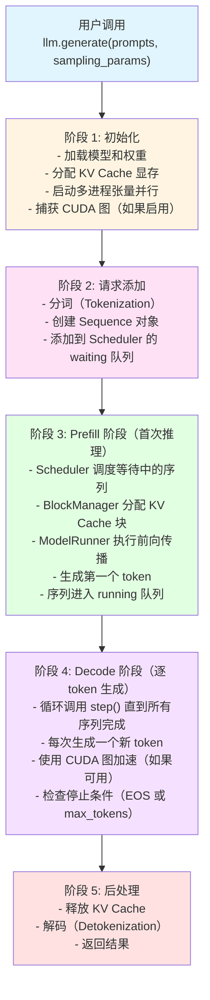

### 2. 核心循环

```python
# LLMEngine.generate() 的核心逻辑

# 1. 添加所有请求
for prompt, sp in zip(prompts, sampling_params):
    self.add_request(prompt, sp)

# 2. 循环执行直到所有序列完成
while not self.is_finished():
    # 2.1 执行一步推理
    outputs, num_tokens = self.step()

    # 2.2 收集完成的序列
    for seq_id, token_ids in outputs:
        results[seq_id] = token_ids

# 3. 解码并返回结果
return [tokenizer.decode(token_ids) for token_ids in results]
```

---

## 初始化流程

### 1. LLMEngine 初始化

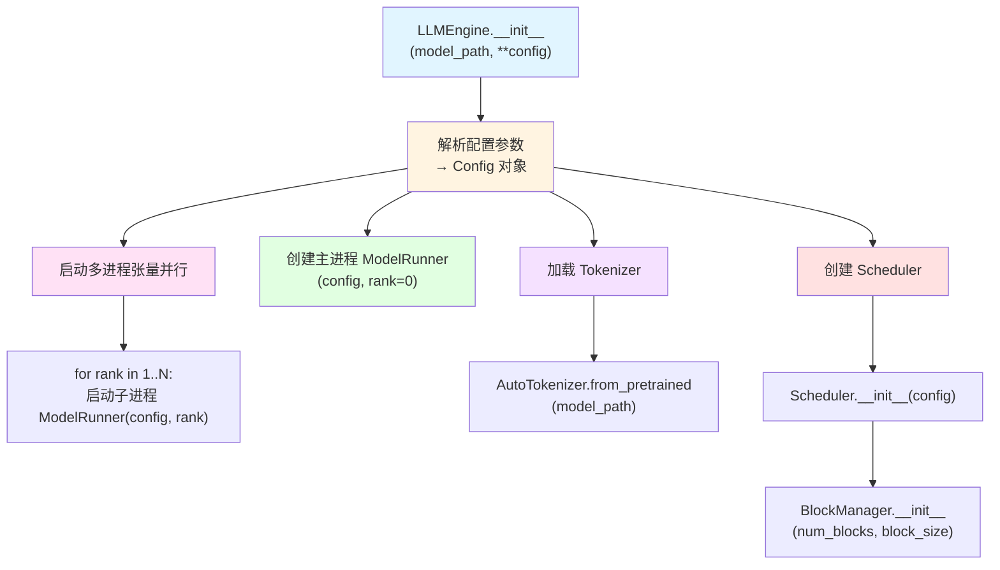

### 2. ModelRunner 初始化

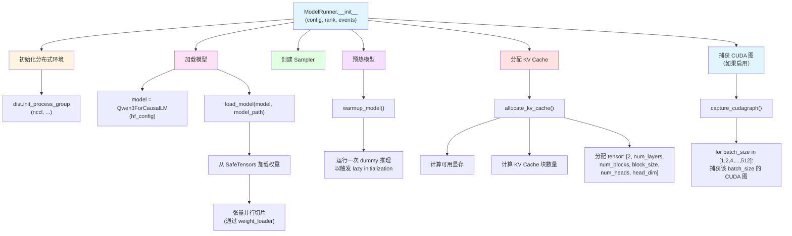

### 3. 多进程架构

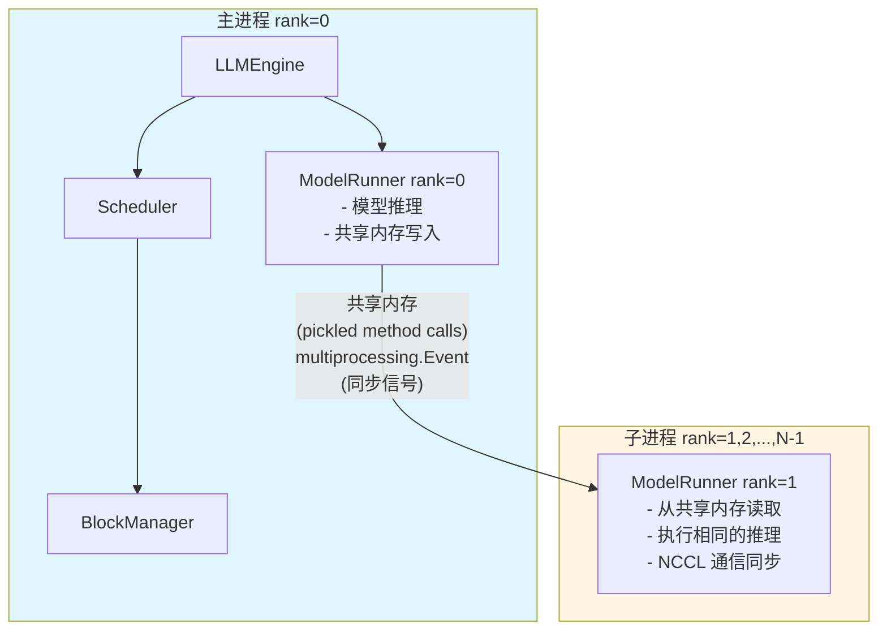

**通信机制**:
```python
# 主进程写入共享内存
def write_shm(self, method_name, *args):
    data = pickle.dumps([method_name, *args])
    n = len(data)
    self.shm.buf[0:4] = n.to_bytes(4, "little")  # 数据长度
    self.shm.buf[4:n+4] = data                    # 序列化数据
    for event in self.events:
        event.set()  # 通知子进程

# 子进程读取共享内存
def read_shm(self):
    self.event.wait()  # 等待信号
    n = int.from_bytes(self.shm.buf[0:4], "little")
    method_name, *args = pickle.loads(self.shm.buf[4:n+4])
    self.event.clear()
    return method_name, args
```

---

## Prefill 阶段流程

### 1. 完整流程图

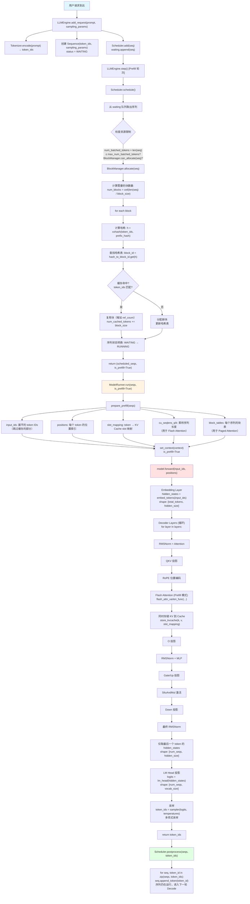

### 2. Prefill 阶段关键点

**输入数据准备**:
```python
# 示例：两个序列
seq1 = [1, 2, 3, 4, 5]  # 长度 5, 缓存了前 3 个 tokens
seq2 = [6, 7, 8]        # 长度 3, 无缓存

# 输入数据
input_ids = [4, 5, 6, 7, 8]  # 仅未缓存的部分
positions = [3, 4, 0, 1, 2]  # 位置索引

# Flash Attention 元数据
cu_seqlens_q = [0, 2, 5]     # seq1 贡献 2 个 tokens, seq2 贡献 3 个
cu_seqlens_k = [0, 5, 8]     # seq1 上下文长度 5, seq2 上下文长度 3
max_seqlen_q = 3
max_seqlen_k = 5

# Slot Mapping (KV Cache 位置)
seq1 的块表: [0, 1]  # 块 0 和块 1
seq2 的块表: [2]     # 块 2

# 块大小 = 16 的情况下
slot_mapping = [
    3, 4,        # seq1 的 token 4,5 → 块 0 的 slot 3,4
    32, 33, 34   # seq2 的 token 6,7,8 → 块 2 的 slot 0,1,2 (offset=32)
]
```

**Prefix Caching 示例**:
```
请求 1: "你是一个AI助手。请介绍自己。"
请求 2: "你是一个AI助手。请讲个笑话。"

公共前缀: "你是一个AI助手。" (假设 10 个 tokens)

块大小 = 16, 公共前缀占用 1 个块

请求 1:
  - 块 0: tokens[0:10] (公共前缀) → 哈希 = h1
  - 块 1: tokens[10:26] → 新分配

请求 2:
  - 块 0: tokens[0:10] (公共前缀) → 哈希 = h1 (命中！)
    → 复用请求 1 的块 0, ref_count = 2
  - 块 1: tokens[10:26] → 新分配

结果: 请求 2 跳过公共前缀的计算，直接从缓存读取 KV！
```

---

## Decode 阶段流程

### 1. 完整流程图

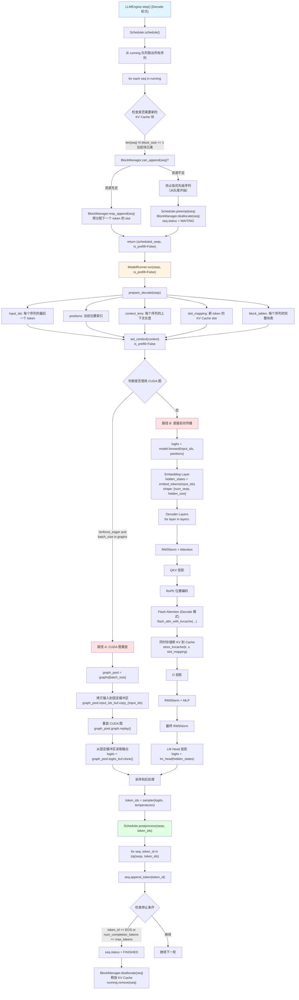

### 2. Decode 阶段关键点

**CUDA 图 vs 直接前向传播**:

```python
# 条件判断
if !enforce_eager and num_seqs in self.graphs:
    # 使用 CUDA 图（更快）
    use_cudagraph = True
else:
    # 直接前向传播（更灵活）
    use_cudagraph = False
```

**CUDA 图优势**:
- 减少 kernel 启动开销（~30% 延迟降低）
- CPU-GPU 同步次数减少
- kernel 调度优化

**CUDA 图限制**:
- 输入形状必须固定（因此仅支持特定 batch sizes）
- 不支持动态控制流
- 首次捕获耗时长

**Decode 阶段输入准备**:
```python
# 示例：3 个序列正在 Decode
seq1 = [1,2,3,4,5,6,7]    # 长度 7, 刚生成了 token 7
seq2 = [8,9,10]           # 长度 3, 刚生成了 token 10
seq3 = [11,12,13,14,15]   # 长度 5, 刚生成了 token 15

# 输入数据
input_ids = [7, 10, 15]       # 每个序列的最后一个 token
positions = [6, 2, 4]         # 当前位置（长度 - 1）
context_lens = [7, 3, 5]      # 每个序列的上下文长度

# Slot Mapping (新 token 的 KV Cache 位置)
# 假设块大小 = 16
seq1 的块表: [0, 1]  # token 7 在块 0 的 slot 7
seq2 的块表: [2]     # token 10 在块 2 的 slot 2
seq3 的块表: [3, 4]  # token 15 在块 3 的 slot 4

slot_mapping = [7, 34, 52]  # (0*16+7, 2*16+2, 3*16+4)
```

---

## 调度器工作流程

### 1. 调度策略流程图

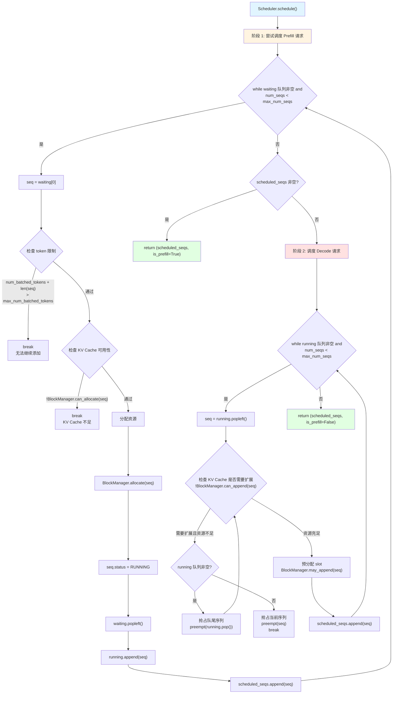

### 2. 调度优先级

```
优先级从高到低:
1. Prefill 请求（减少用户等待时间）
2. Decode 请求（保持序列继续生成）

抢占顺序:
1. 优先抢占 running 队列尾部的序列（后进先出）
2. 如果 running 为空，抢占当前序列自己
```

### 3. 资源抢占机制

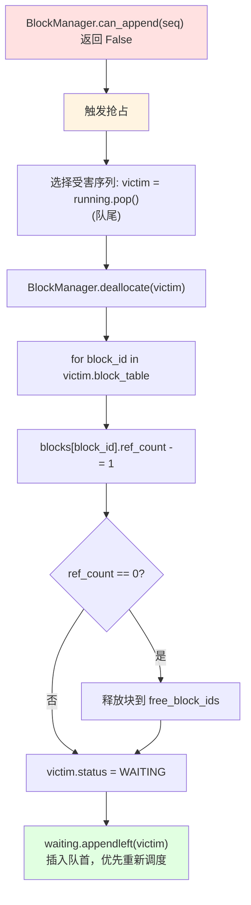

**抢占示例**:
```
场景: KV Cache 不足，需要为新 token 分配块

running = [seq1, seq2, seq3, seq4]

# seq4 需要新块，但 free_block_ids 为空
抢占 seq4 自己（队尾）
    → seq4.status = WAITING
    → 释放 seq4 的所有块
    → waiting.appendleft(seq4)

running = [seq1, seq2, seq3]

下一轮:
    seq1, seq2, seq3 继续 Decode
    seq4 在 waiting 队列等待资源
```

---

## KV Cache 管理流程

### 1. 分配流程

```mermaid
graph TD
    A["BlockManager.allocate(seq)"] --> B["计算需要的块数量<br/>num_blocks = ceil(len(seq) / block_size)"]
    B --> C["for i in range(num_blocks)"]

    C --> D["获取当前块的 tokens<br/>token_ids = seq.block(i)"]
    D --> E{计算哈希<br/>len(token_ids) == block_size?}
    E -->|是| F["h = xxhash(token_ids, prefix=previous_hash)"]
    E -->|否| G["h = -1<br/>不完整的块不缓存"]

    F --> H["查找哈希表<br/>block_id = hash_to_block_id.get(h, -1)"]
    G --> H

    H --> I{验证哈希<br/>block_id != -1 and<br/>blocks[block_id].token_ids == token_ids?}
    I -->|是<br/>缓存命中| J{block_id in used_block_ids?}
    I -->|否<br/>缓存未命中| K["从 free_block_ids 获取新块<br/>block_id = free_block_ids[0]"]

    J -->|是| L["块正在使用<br/>增加引用计数<br/>blocks[block_id].ref_count += 1"]
    J -->|否| M["块已释放但哈希仍在表中<br/>重新分配该块<br/>_allocate_block(block_id)"]

    K --> N["_allocate_block(block_id)<br/>blocks[block_id].reset()<br/>free_block_ids.remove(block_id)<br/>used_block_ids.add(block_id)"]
    N --> O["更新哈希表<br/>blocks[block_id].update(h, token_ids)<br/>hash_to_block_id[h] = block_id"]

    L --> P[完成]
    M --> P
    O --> P

    style A fill:#e1f5ff
    style J fill:#fff4e1
    style I fill:#ffe1e1
    style P fill:#e1ffe1
```

### 2. 追加流程

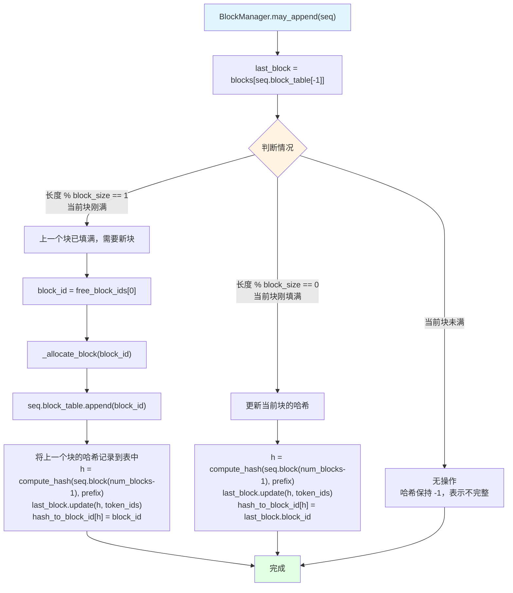

### 3. 释放流程

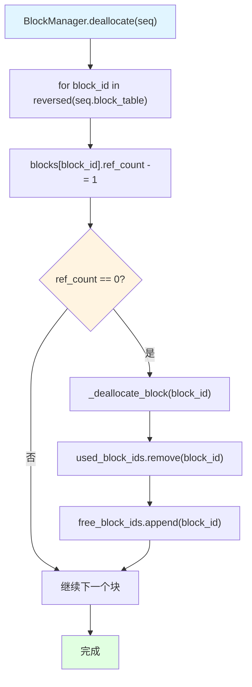

### 4. KV Cache 内存布局

```
KV Cache Tensor:
shape = [2, num_layers, num_blocks, block_size, num_kv_heads, head_dim]
         │   │           │           │            │              │
         │   │           │           │            │              └─► 每个头的维度 (128)
         │   │           │           │            └────────────────► KV 头数 (2)
         │   │           │           └─────────────────────────────► 块大小 (256)
         │   │           └─────────────────────────────────────────► 块数量 (动态计算)
         │   └─────────────────────────────────────────────────────► 层数 (28)
         └─────────────────────────────────────────────────────────► K/V (0=K, 1=V)

示例:
  Qwen3-0.6B, block_size=256, num_blocks=1000
  内存占用: 2 * 28 * 1000 * 256 * 2 * 128 * 2 bytes (bfloat16)
          = ~3.6 GB
```

**Slot Mapping 示例**:
```
序列: [1,2,3,4,5,6,7,8]
块表: [5, 12]  # 块 5 和块 12
块大小: 16

Slot Mapping:
  token 1 → slot 5*16+0 = 80
  token 2 → slot 5*16+1 = 81
  ...
  token 8 → slot 5*16+7 = 87

KV Cache 访问:
  k_cache[layer_id, block_id, slot_in_block, head_id, :]
  = k_cache[0, 5, 7, 0, :]  # 第 0 层, 块 5, slot 7, 头 0
```

---

## 张量并行通信流程

### 1. 权重加载阶段

```mermaid
graph TD
    A["load_model(model, model_path)"] --> B["for name, param in model.named_parameters()"]
    B --> C{hasattr(param, 'weight_loader')?}
    C -->|是| D["param.weight_loader(param, loaded_weight)"]

    D --> E["计算切片范围<br/>shard_size = param.size(tp_dim)<br/>start_idx = tp_rank * shard_size"]
    E --> F["切片权重<br/>loaded_weight = loaded_weight.narrow(tp_dim, start_idx, shard_size)"]
    F --> G["复制到参数<br/>param.data.copy_(loaded_weight)"]

    C -->|否| H[跳过]
    G --> H
    H --> I[完成]

    style A fill:#e1f5ff
    style D fill:#fff4e1
    style I fill:#e1ffe1
```

**示例**:
```
完整权重: [4096, 14336]  # output_size, input_size
TP size = 2

GPU 0: [4096, 7168]  # 切分 input_size 维度
GPU 1: [4096, 7168]
```

### 2. 前向传播阶段

#### 词嵌入层（VocabParallelEmbedding）

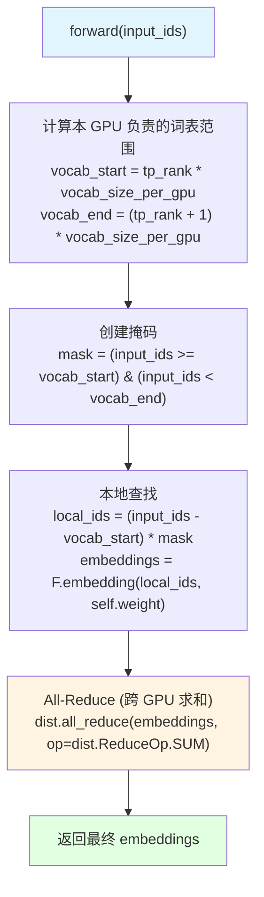

**示例**:
```
vocab_size = 10000, TP size = 2

GPU 0 负责: vocab[0:5000]
GPU 1 负责: vocab[5000:10000]

input_ids = [123, 6789]

GPU 0:
  - token 123 → embedding[123]
  - token 6789 → zero (超出范围)

GPU 1:
  - token 123 → zero (超出范围)
  - token 6789 → embedding[6789-5000]

All-Reduce 后:
  - token 123 → GPU 0 的 embedding[123]
  - token 6789 → GPU 1 的 embedding[1789]
```

#### 列并行线性层（ColumnParallelLinear）

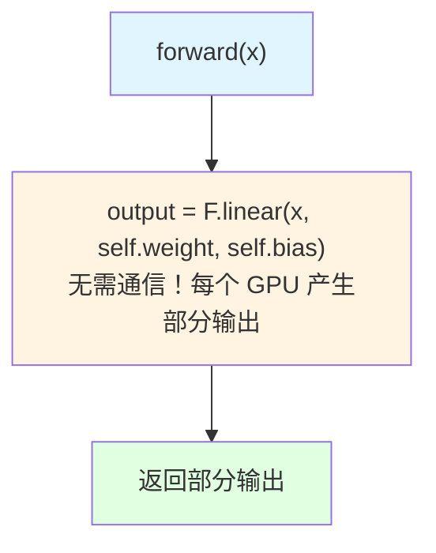

**示例**:
```
input: [batch, seq, 4096]
完整权重: [14336, 4096]
TP size = 2

GPU 0:
  weight: [7168, 4096]
  output: [batch, seq, 7168]

GPU 1:
  weight: [7168, 4096]
  output: [batch, seq, 7168]

下一层会自动拼接（或使用 RowParallelLinear）
```

#### 行并行线性层（RowParallelLinear）

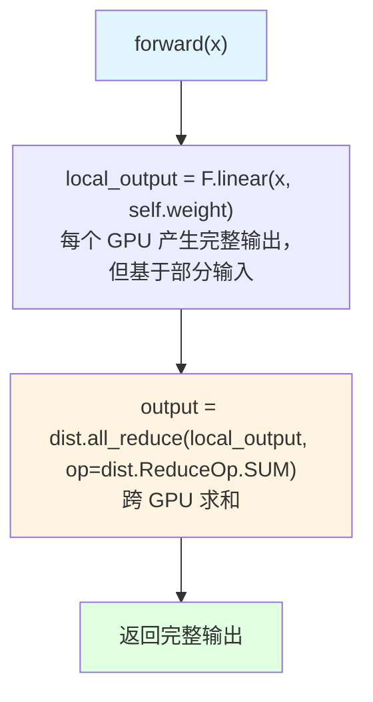

**示例**:
```
input: [batch, seq, 14336]（已被列切分）
完整权重: [4096, 14336]
TP size = 2

GPU 0:
  weight: [4096, 7168]
  input: [batch, seq, 7168]（前半部分）
  local_output: [batch, seq, 4096]

GPU 1:
  weight: [4096, 7168]
  input: [batch, seq, 7168]（后半部分）
  local_output: [batch, seq, 4096]

All-Reduce:
  output = GPU0_output + GPU1_output
```

### 3. 通信模式总结

```
VocabParallelEmbedding:
  input → local_embed → all_reduce → output

ColumnParallelLinear:
  input → local_linear → output (无通信)

RowParallelLinear:
  input → local_linear → all_reduce → output

QKV 投影:
  input → ColumnParallelLinear (QKV 并行) → output (无通信)

Attention:
  Q,K,V → Flash Attention (本地) → output (无通信)

O 投影:
  input → RowParallelLinear → all_reduce → output

MLP Gate/Up:
  input → MergedColumnParallelLinear → output (无通信)

MLP Down:
  input → RowParallelLinear → all_reduce → output
```

**每层的通信次数**: 2 次 All-Reduce（O 投影 + MLP Down 投影）

---

## CUDA 图优化流程

### 1. 捕获流程

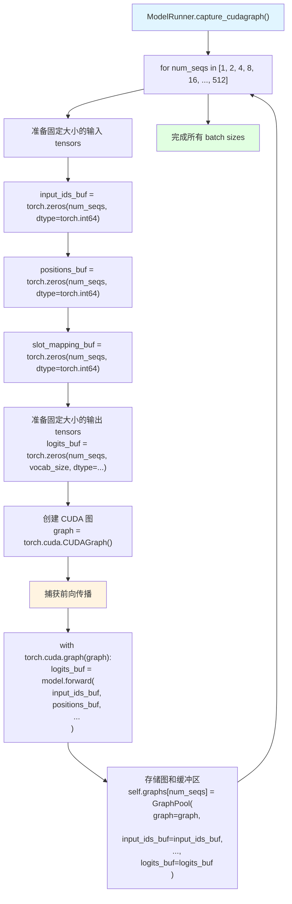

### 2. 重放流程

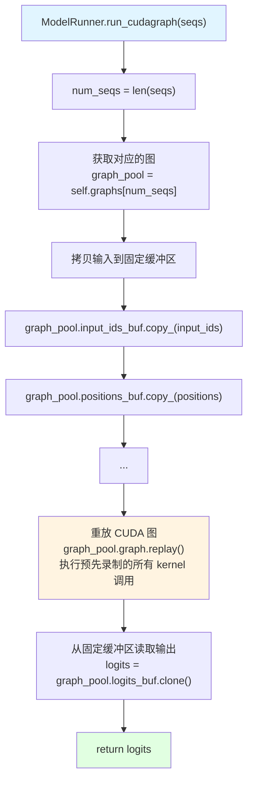

### 3. CUDA 图优势

```
传统执行:
  Python → PyTorch API → CUDA kernel 启动 (多次 CPU-GPU 同步)

CUDA 图执行:
  Python → 重放图 (一次 CPU-GPU 同步，内部无同步)

性能提升:
  - Kernel 启动开销: ~30% 降低
  - CPU-GPU 同步: ~90% 减少
  - 端到端延迟: ~20-30% 降低
```

### 4. 支持的 Batch Sizes

```
# 捕获的 batch sizes (2 的幂次)
supported_batch_sizes = [1, 2, 4, 8, 16, 32, 64, 128, 256, 512]

# 实际使用
if num_seqs in supported_batch_sizes:
    use_cudagraph = True
else:
    use_cudagraph = False  # 降级到直接前向传播
```

---

## 完整时序图

### 单个请求的完整生命周期

```mermaid
graph TD
    A["T0: 用户调用 llm.generate(['Hello'])"] --> B["LLMEngine.add_request('Hello', sampling_params)"]
    B --> B1["Tokenizer.encode('Hello') → [1234]"]
    B --> B2["Sequence([1234], sampling_params) → waiting 队列"]

    B2 --> C["T1: LLMEngine.step() [第 1 轮]"]
    C --> D["Scheduler.schedule()"]
    D --> D1["调度 seq 从 waiting → running"]
    D1 --> D2["BlockManager.allocate(seq) → 分配块 [5]"]

    D2 --> E["ModelRunner.run(seqs, is_prefill=True)"]
    E --> E1["prepare_prefill([seq])<br/>input_ids=[1234], positions=[0]"]
    E1 --> E2["model.forward(input_ids, positions)"]
    E2 --> E3["Embedding → hidden_states"]
    E3 --> E4["Decoder Layers (Flash Attention Prefill)<br/>存储 KV 到块 5"]
    E4 --> E5["LM Head → logits"]
    E5 --> E6["sampler(logits) → token_id=5678"]

    E6 --> F["Scheduler.postprocess([seq], [5678])"]
    F --> F1["seq.append_token(5678)<br/>seq = [1234, 5678]"]

    F1 --> G["T2: LLMEngine.step() [第 2 轮]"]
    G --> H["Scheduler.schedule()"]
    H --> H1["调度 seq (Decode 阶段)<br/>BlockManager.may_append(seq)"]

    H1 --> I["ModelRunner.run(seqs, is_prefill=False)"]
    I --> I1["prepare_decode([seq])<br/>input_ids=[5678], positions=[1], context_lens=[2]"]
    I1 --> I2["使用 CUDA 图重放 (batch_size=1)"]
    I2 --> I3["拷贝输入到缓冲区"]
    I3 --> I4["graph.replay()"]
    I4 --> I5["Flash Attention Decode (读取块 5 的 KV)"]
    I5 --> I6["读取 logits"]
    I6 --> I7["sampler(logits) → token_id=9012"]

    I7 --> J["Scheduler.postprocess([seq], [9012])"]
    J --> J1["seq.append_token(9012)<br/>seq = [1234, 5678, 9012]"]

    J1 --> K["T3-TN: 重复 Decode 阶段..."]

    K --> L["TN: Decode 完成"]
    L --> L1["token_id = EOS"]
    L1 --> L2["Scheduler.postprocess()"]
    L2 --> L3["seq.status = FINISHED"]
    L3 --> L4["BlockManager.deallocate(seq)<br/>释放块 5"]

    L4 --> M["LLMEngine.generate() 返回"]
    M --> M1["Tokenizer.decode([1234, 5678, 9012, ...])<br/>→ 'Hello, how can I help you today?'"]

    style A fill:#e1f5ff
    style C fill:#fff4e1
    style E fill:#ffe1e1
    style G fill:#fff4e1
    style I fill:#ffe1e1
    style L fill:#ffffe1
    style M1 fill:#e1ffe1
```

---

## 总结

### 核心流程特点

1. **两阶段推理**:
   - Prefill: 并行处理所有输入 tokens
   - Decode: 逐个生成输出 tokens

2. **动态调度**:
   - 连续批处理（Continuous Batching）
   - 优先级调度（Prefill > Decode）
   - 资源抢占（Preemption）

3. **高效内存管理**:
   - 分块 KV Cache（Paged Attention）
   - Prefix Caching（哈希共享）
   - 引用计数（Copy-on-Write）

4. **性能优化**:
   - CUDA 图（减少启动开销）
   - Flash Attention（O(N) 内存）
   - 张量并行（多 GPU 加速）

5. **多进程协同**:
   - 共享内存通信
   - NCCL 集合通信
   - 事件同步

这些设计共同构成了一个高性能、高效率的大语言模型推理引擎！
