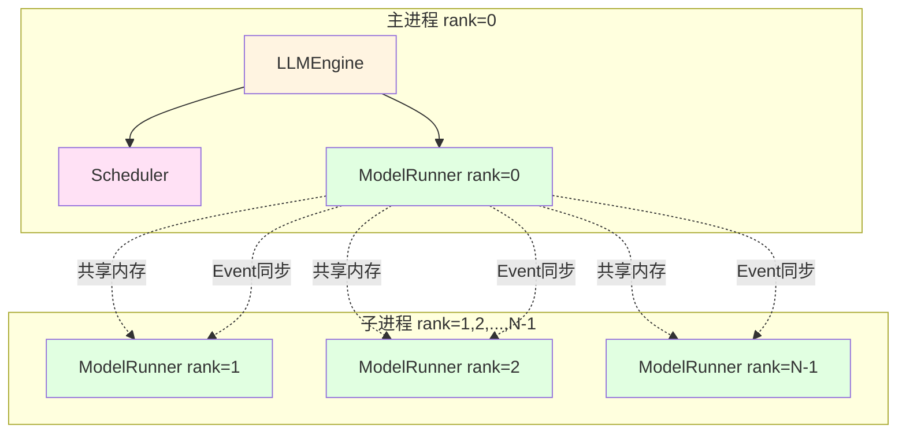
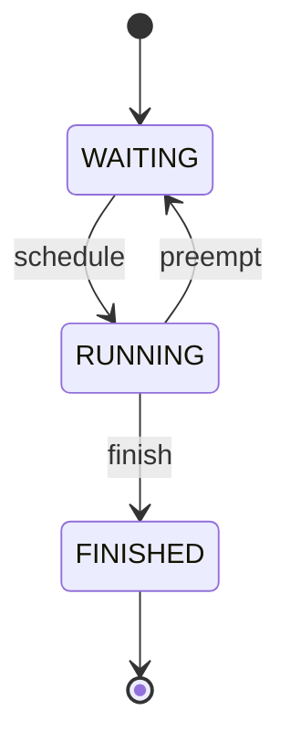
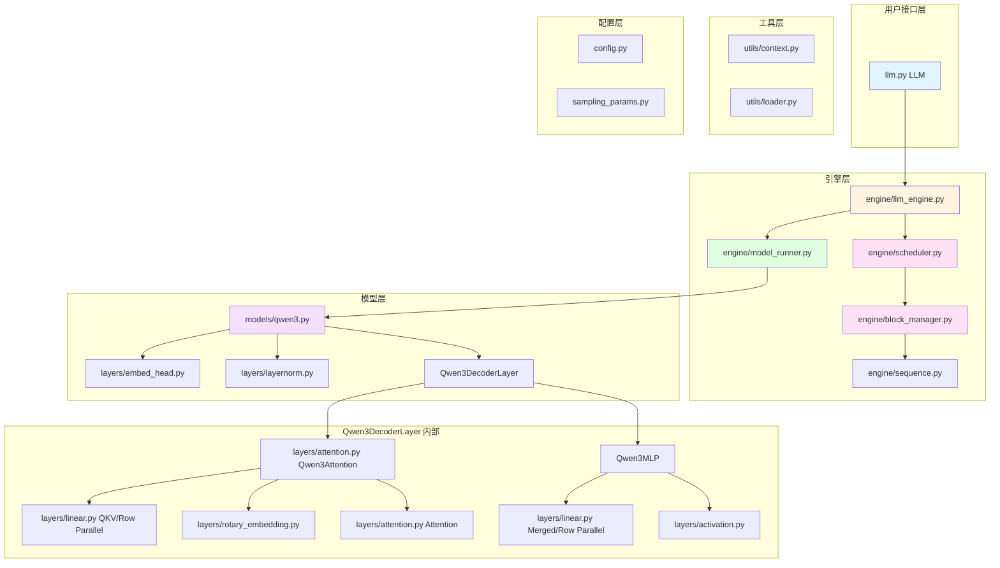
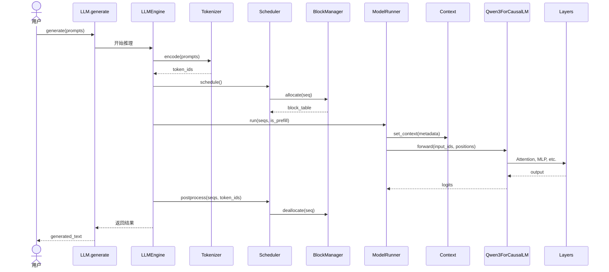

# Nano-vLLM 模块拆分与用途详解

## 目录
1. [模块总览](#模块总览)
2. [Engine 模块 - 推理引擎核心](#engine-模块---推理引擎核心)
3. [Layers 模块 - 神经网络层](#layers-模块---神经网络层)
4. [Models 模块 - 模型架构](#models-模块---模型架构)
5. [Utils 模块 - 工具模块](#utils-模块---工具模块)
6. [配置模块](#配置模块)
7. [模块依赖关系图](#模块依赖关系图)

---

## 模块总览

Nano-vLLM 采用**分层模块化设计**，共分为 5 大核心模块：

| 模块 | 目录 | 文件数 | 核心职责 | 重要性 |
|------|------|--------|----------|--------|
| **Engine** | `nanovllm/engine/` | 5 | 推理引擎控制、调度、资源管理 | ★★★★★ |
| **Layers** | `nanovllm/layers/` | 7 | 可复用的神经网络算子 | ★★★★★ |
| **Models** | `nanovllm/models/` | 1 | 具体模型架构实现 | ★★★★★ |
| **Utils** | `nanovllm/utils/` | 2 | 辅助工具（上下文、权重加载） | ★★★★ |
| **Config** | `nanovllm/` | 3 | 配置管理和用户接口 | ★★★ |

---

## Engine 模块 - 推理引擎核心

**目录**: `nanovllm/engine/`
**作用**: 推理引擎的核心逻辑，负责请求调度、资源管理、模型执行

### 📁 文件清单

#### 1. `llm_engine.py` (93 行) ⭐⭐⭐⭐⭐
**作用**: 推理引擎主控制器，是整个推理流程的中央协调者

**核心职责**:
- ✅ 多进程张量并行管理（通过 `multiprocessing.spawn`）
- ✅ 协调 `Scheduler` 和 `ModelRunner`
- ✅ 分词（Tokenization）和解码（Detokenization）
- ✅ 批量推理接口（`generate()`）
- ✅ 进度条显示和吞吐量统计

**关键类与方法**:

```python
class LLMEngine:
    def __init__(self, model, **kwargs):
        # 初始化配置
        # 启动多进程张量并行 worker
        # 创建 Scheduler 和 ModelRunner
        # 加载 Tokenizer

    def add_request(self, prompt, sampling_params):
        # 将用户请求添加到调度队列

    def step(self):
        # 执行一步推理（Prefill 或 Decode）
        # 1. 调度器调度序列
        # 2. ModelRunner 执行前向传播
        # 3. 后处理（更新序列状态）
        # 返回：完成的序列 + token 数量

    def generate(self, prompts, sampling_params):
        # 批量生成接口
        # 循环调用 step() 直到所有序列完成
```

**多进程架构**:



**通信方式**:
- 共享内存（输入/输出 tensors）
- multiprocessing.Event（同步信号）

**性能监控**:
- Prefill 吞吐量（tokens/s）
- Decode 吞吐量（tokens/s）
- 实时进度条（tqdm）

---

#### 2. `model_runner.py` (251 行) ⭐⭐⭐⭐⭐ **[最大文件]**
**作用**: 模型执行器，负责实际的模型推理计算

**核心职责**:
- ✅ CUDA 图捕获和重放（性能优化关键）
- ✅ KV Cache 内存分配和管理
- ✅ 输入数据准备（input_ids, positions, slot_mapping）
- ✅ 张量并行通信（NCCL All-Reduce）
- ✅ Prefill/Decode 阶段切换
- ✅ 共享内存多进程通信

**关键类与方法**:

```python
class ModelRunner:
    def __init__(self, config, rank, events):
        # 初始化分布式环境（NCCL）
        # 加载模型和权重
        # 分配 KV Cache 显存
        # 预热模型和捕获 CUDA 图

    def call(self, method, *args):
        # 主进程与子进程通信的统一接口
        # 方法：run, exit

    def run(self, seqs, is_prefill):
        # 执行推理
        # Prefill: 直接前向传播
        # Decode: 优先使用 CUDA 图重放

    def capture_cudagraph(self, num_seqs):
        # 捕获特定 batch size 的 CUDA 图
        # 预分配固定大小的输入输出 tensors

    def allocate_kv_cache(self):
        # 动态计算和分配 KV Cache 显存
        # 考虑模型参数、激活值、GPU 内存利用率
```

**CUDA 图优化**:
```python
# 捕获阶段（warmup 时）
with torch.cuda.graph(cuda_graph):
    output = model.forward(fixed_inputs)

# 重放阶段（实际推理时）
input_buffer.copy_(actual_input)  # 拷贝输入到固定缓冲区
cuda_graph.replay()               # 重放 CUDA 图
result = output_buffer.clone()    # 从固定缓冲区读取输出
```

**内存管理策略**:
- 参数内存 = `model_params_bytes`
- 激活内存 = `max_num_batched_tokens * hidden_size * dtype_size * N_layers`
- KV Cache 内存 = `gpu_memory * utilization - params - activation`

---

#### 3. `scheduler.py` (71 行) ⭐⭐⭐⭐
**作用**: 请求调度器，决定哪些序列在什么时候执行

**核心职责**:
- ✅ 管理等待队列（`waiting`）和运行队列（`running`）
- ✅ 动态调度 Prefill 和 Decode 阶段
- ✅ 资源抢占（Preemption）机制
- ✅ 批处理优化（最大化 GPU 利用率）

**调度策略**:

```python
class Scheduler:
    def schedule(self):
        # 阶段 1: 优先调度 Prefill 请求
        if waiting 队列非空:
            while 资源充足:
                - 检查序列长度是否超过 max_num_batched_tokens
                - 检查 KV Cache 是否足够分配
                - 分配 KV Cache 块
                - 将序列移至 running 队列
            return prefill_seqs, is_prefill=True

        # 阶段 2: 调度 Decode 请求
        for seq in running:
            if KV Cache 不足以追加新 token:
                抢占低优先级序列（从队尾开始）
            else:
                预分配下一个 token 的 KV Cache slot
        return decode_seqs, is_prefill=False

    def preempt(self, seq):
        # 抢占序列：释放 KV Cache，移回 waiting 队列

    def postprocess(self, seqs, token_ids):
        # 更新序列状态
        # 检查是否达到停止条件（EOS 或 max_tokens）
        # 释放完成序列的 KV Cache
```

**调度优先级**:
1. **Prefill > Decode**: 新请求优先处理（减少用户等待时间）
2. **FIFO**: 同类请求按先来先服务
3. **抢占策略**: 从 running 队列尾部开始抢占（后进先出）

**资源限制**:
- `max_num_seqs`: 最大并发序列数（默认 512）
- `max_num_batched_tokens`: 单批次最大 token 数（默认 16384）

---

#### 4. `sequence.py` (83 行) ⭐⭐⭐⭐
**作用**: 序列数据结构，表示单个推理请求的完整状态

**核心职责**:
- ✅ 管理 token IDs（prompt + completion）
- ✅ 维护序列状态（WAITING/RUNNING/FINISHED）
- ✅ 存储块表（Block Table）
- ✅ 支持序列化/反序列化（多进程通信）

**数据结构**:

```python
class Sequence:
    seq_id: int                      # 唯一标识符
    prompt_token_ids: list[int]      # 输入 prompt
    completion_token_ids: list[int]  # 生成的 tokens
    status: SequenceStatus           # WAITING/RUNNING/FINISHED
    block_table: list[int]           # KV Cache 块索引表
    num_cached_tokens: int           # Prefix Cache 命中的 token 数

    # 采样参数
    temperature: float
    max_tokens: int
    ignore_eos: bool

    def append_token(self, token_id):
        # 追加新生成的 token

    def block(self, idx) -> list[int]:
        # 获取第 idx 个块的 token IDs

    @property
    def num_blocks(self):
        # 计算需要的 KV Cache 块数量
```

**序列状态机**:



**块表（Block Table）示例**:
```
序列长度 = 48 tokens, 块大小 = 16
block_table = [5, 12, 7]

块 5: tokens[0:16]
块 12: tokens[16:32]
块 7: tokens[32:48]
```

---

#### 5. `block_manager.py` (112 行) ⭐⭐⭐⭐⭐
**作用**: KV Cache 块管理器，实现 Prefix Caching

**核心职责**:
- ✅ 块级 KV Cache 分配和回收
- ✅ Prefix Caching（基于哈希的块共享）
- ✅ 引用计数管理（Copy-on-Write）
- ✅ 哈希碰撞检测

**核心数据结构**:

```python
class Block:
    block_id: int           # 块 ID
    ref_count: int          # 引用计数
    hash: int               # token 序列哈希值
    token_ids: list[int]    # 缓存的 token IDs（用于碰撞检测）

class BlockManager:
    blocks: list[Block]                # 所有块
    hash_to_block_id: dict[int, int]   # 哈希 → 块 ID 映射
    free_block_ids: deque[int]         # 空闲块队列
    used_block_ids: set[int]           # 已使用块集合
```

**Prefix Caching 算法**:

```python
def allocate(self, seq):
    h = -1
    cache_miss = False
    for i in range(seq.num_blocks):
        token_ids = seq.block(i)

        # 计算增量哈希
        if len(token_ids) == block_size:
            h = compute_hash(token_ids, prefix=h)

        # 查找哈希表
        block_id = hash_to_block_id.get(h, -1)

        # 验证哈希（防止碰撞）
        if block_id != -1 and blocks[block_id].token_ids == token_ids:
            # 缓存命中！
            if block_id in used_block_ids:
                # 块已被使用，增加引用计数
                blocks[block_id].ref_count += 1
            else:
                # 块未使用，重新分配
                allocate_block(block_id)
            seq.num_cached_tokens += block_size
        else:
            # 缓存未命中，分配新块
            cache_miss = True
            block_id = free_block_ids[0]
            allocate_block(block_id)

        # 更新哈希表
        blocks[block_id].update(h, token_ids)
        hash_to_block_id[h] = block_id
        seq.block_table.append(block_id)
```

**引用计数（Copy-on-Write）**:
- `ref_count = 1`: 独占块
- `ref_count > 1`: 共享块（只读）
- `ref_count = 0`: 空闲块

**优势**:
- 多轮对话中复用系统提示词的 KV Cache
- 批量请求中共享公共前缀
- 减少冗余计算和内存占用

**示例**:
```
请求 1: "你是一个AI助手。请介绍自己。"
请求 2: "你是一个AI助手。请讲个笑话。"

公共前缀 "你是一个AI助手。" 的 KV Cache 块被共享
ref_count = 2
```

---

## Layers 模块 - 神经网络层

**目录**: `nanovllm/layers/`
**作用**: 提供可复用的神经网络算子，支持张量并行和高性能优化

### 📁 文件清单

#### 1. `attention.py` (75 行) ⭐⭐⭐⭐⭐
**作用**: Flash Attention 集成，处理注意力计算

**核心技术**:
- **Prefill 阶段**: `flash_attn_varlen_func`（变长序列批处理）
- **Decode 阶段**: `flash_attn_with_kvcache`（直接读写 KV Cache）
- **Triton 内核**: `store_kvcache_kernel`（高性能 KV Cache 存储）

**关键代码**:

```python
@triton.jit
def store_kvcache_kernel(...):
    # 使用 Triton 编写的 GPU 内核
    # 将 key/value 存储到 KV Cache
    idx = tl.program_id(0)
    slot = tl.load(slot_mapping_ptr + idx)
    key = tl.load(key_ptr + ...)
    value = tl.load(value_ptr + ...)
    tl.store(k_cache_ptr + cache_offsets, key)
    tl.store(v_cache_ptr + cache_offsets, value)

class Attention(nn.Module):
    def forward(self, q, k, v):
        # 1. 存储 KV 到 Cache
        store_kvcache(k, v, k_cache, v_cache, slot_mapping)

        if context.is_prefill:
            # 2a. Prefill: 变长序列批处理
            o = flash_attn_varlen_func(
                q, k, v,
                cu_seqlens_q=...,    # 累积序列长度
                max_seqlen_q=...,    # 最大序列长度
                causal=True,          # 因果掩码
                block_table=...       # 块表（用于 Prefix Cache）
            )
        else:
            # 2b. Decode: 从 KV Cache 读取
            o = flash_attn_with_kvcache(
                q.unsqueeze(1),       # [batch, 1, num_heads, head_dim]
                k_cache, v_cache,
                cache_seqlens=...,    # 每个序列的上下文长度
                block_table=...,      # 块表
                causal=True
            )
        return o
```

**优势**:
- O(N) 内存复杂度（vs 标准 Attention 的 O(N²)）
- IO 优化（减少 HBM ↔ SRAM 数据传输）
- 直接支持 Paged Attention（通过 `block_table`）

---

#### 2. `linear.py` (153 行) ⭐⭐⭐⭐⭐
**作用**: 张量并行线性层

**核心类**:

##### `ColumnParallelLinear` (列切分)
```python
# 权重切分方式：
# 完整权重: [output_size, input_size]
# GPU 0: [output_size/N, input_size]
# GPU 1: [output_size/N, input_size]
# ...
# GPU N-1: [output_size/N, input_size]

# 前向传播：
input: [batch, seq_len, input_size]
output: [batch, seq_len, output_size/N]  # 每个 GPU 产生部分输出
# 无需通信！
```

##### `RowParallelLinear` (行切分 + All-Reduce)
```python
# 权重切分方式：
# 完整权重: [output_size, input_size]
# GPU 0: [output_size, input_size/N]
# GPU 1: [output_size, input_size/N]
# ...

# 前向传播：
input: [batch, seq_len, input_size]
local_output = F.linear(input, weight)  # [batch, seq_len, output_size]
output = all_reduce(local_output)       # 跨 GPU 求和
```

##### `QKVParallelLinear` (专用于注意力投影)
```python
# 同时计算 Q, K, V 三个投影
# 权重布局: [num_heads * 3 * head_dim, hidden_size]
# 切分维度: num_heads（保持 head_dim 完整）
```

##### `MergedColumnParallelLinear` (合并门控投影)
```python
# 用于 MLP 的 gate_proj 和 up_proj 融合
# 权重布局: [(gate_size + up_size), hidden_size]
# 减少 kernel 启动次数
```

**权重加载机制**:
```python
def weight_loader(self, param, loaded_weight):
    # 自动切片权重到对应的 GPU
    shard_size = param.size(tp_dim)
    start_idx = tp_rank * shard_size
    loaded_weight = loaded_weight.narrow(tp_dim, start_idx, shard_size)
    param.data.copy_(loaded_weight)
```

---

#### 3. `layernorm.py` (50 行) ⭐⭐⭐
**作用**: RMSNorm 归一化层（带残差融合）

**核心实现**:

```python
@torch.compile
def rmsnorm_with_residual(hidden, residual, weight, eps):
    # 融合 RMSNorm 和残差连接
    # 避免额外的 kernel 启动和内存读写
    orig_dtype = hidden.dtype
    hidden = hidden + residual            # 残差连接
    residual = hidden.to(torch.float32)   # 保存残差

    # RMSNorm
    variance = hidden.pow(2).mean(-1, keepdim=True)
    hidden = hidden * torch.rsqrt(variance + eps)
    return weight * hidden.to(orig_dtype), residual

class RMSNorm(nn.Module):
    def forward(self, x, residual=None):
        if residual is not None:
            return rmsnorm_with_residual(x, residual, self.weight, self.eps)
        else:
            return rmsnorm(x, self.weight, self.eps)
```

**优化**:
- `@torch.compile`: 即时编译为优化的 CUDA 代码
- 残差融合: 减少 30% 的内存访问
- 混合精度: 计算使用 float32，存储使用 float16/bfloat16

---

#### 4. `rotary_embedding.py` (61 行) ⭐⭐⭐
**作用**: 旋转位置编码（RoPE）

**核心实现**:

```python
@torch.compile
def apply_rotary_emb(q, k, cos, sin, cos_k, sin_k):
    # 应用旋转矩阵
    # q' = q * cos + rotate_half(q) * sin
    q_embed = (q * cos) + (rotate_half(q) * sin)
    k_embed = (k * cos_k) + (rotate_half(k) * sin_k)
    return q_embed, k_embed

def rotate_half(x):
    # 将特征分为两半并旋转
    x1 = x[..., : x.shape[-1] // 2]
    x2 = x[..., x.shape[-1] // 2 :]
    return torch.cat((-x2, x1), dim=-1)
```

**优势**:
- 相对位置编码（支持任意长度推理）
- 无需额外参数（仅存储预计算的 cos/sin 表）
- `@torch.compile` 优化

---

#### 5. `sampler.py` (15 行) ⭐⭐
**作用**: Token 采样器

**核心实现**:

```python
@torch.compile
def sample(logits, temperatures):
    # 温度缩放 + 多项式采样
    logits = logits / temperatures[:, None]
    probs = torch.softmax(logits, dim=-1)
    return torch.multinomial(probs, num_samples=1).squeeze(1)

class Sampler(nn.Module):
    def forward(self, logits, temperatures):
        # logits: [batch_size, vocab_size]
        # temperatures: [batch_size]
        # 支持每个序列独立的温度参数
        return sample(logits, temperatures)
```

**特点**:
- 仅支持温度采样（不支持 Top-k/Top-p）
- 每个序列独立温度参数
- `@torch.compile` 加速

---

#### 6. `activation.py` (14 行) ⭐⭐
**作用**: 激活函数（SiluAndMul）

```python
class SiluAndMul(nn.Module):
    def forward(self, x):
        # 门控机制：gate * activation(input)
        # x: [batch, seq_len, 2 * intermediate_size]
        gate, x = x.chunk(2, dim=-1)
        return F.silu(gate) * x
```

用于 Qwen3 的 MLP 门控机制。

---

#### 7. `embed_head.py` (66 行) ⭐⭐⭐
**作用**: 词嵌入和语言模型头

**核心类**:

##### `VocabParallelEmbedding` (词嵌入)
```python
# 词表切分：
# GPU 0: vocab[0 : vocab_size/N]
# GPU 1: vocab[vocab_size/N : 2*vocab_size/N]
# ...

def forward(self, input_ids):
    # 仅查找本 GPU 对应的词表范围
    mask = (input_ids >= start_idx) & (input_ids < end_idx)
    local_ids = input_ids - start_idx
    embeddings = F.embedding(local_ids * mask)
    return all_reduce(embeddings)  # 跨 GPU 求和
```

##### `ParallelLMHead` (输出投影)
```python
# 类似 VocabParallelEmbedding 的反向操作
# 每个 GPU 计算部分词表的 logits
def forward(self, hidden_states):
    logits = F.linear(hidden_states, self.weight)  # 部分 logits
    return logits  # 不需要 all_reduce（采样时仅需本地 logits）
```

---

## Models 模块 - 模型架构

**目录**: `nanovllm/models/`
**作用**: 具体模型架构的实现

### 📁 `qwen3.py` (215 行) ⭐⭐⭐⭐⭐

**支持模型**:
- Qwen3-0.6B
- Qwen3-1.5B
- Qwen2（兼容）

**架构组件**:

#### `Qwen3Attention` (多头注意力)
```python
class Qwen3Attention(nn.Module):
    def __init__(self):
        # GQA (Grouped Query Attention)
        self.num_heads = 16           # Query 头数
        self.num_kv_heads = 2         # Key/Value 头数（更少）

        # 投影层
        self.qkv_proj = QKVParallelLinear(...)
        self.o_proj = RowParallelLinear(...)

        # 位置编码
        self.rotary_emb = RotaryEmbedding(...)

        # 注意力
        self.attn = Attention(...)

    def forward(self, hidden_states, positions):
        # 1. QKV 投影
        qkv = self.qkv_proj(hidden_states)
        q, k, v = qkv.split([...])

        # 2. 应用 RoPE
        q, k = self.rotary_emb(q, k, positions)

        # 3. 注意力计算
        attn_output = self.attn(q, k, v)

        # 4. 输出投影
        output = self.o_proj(attn_output)
        return output
```

#### `Qwen3MLP` (门控 FFN)
```python
class Qwen3MLP(nn.Module):
    def __init__(self):
        # 融合 gate_proj 和 up_proj
        self.gate_up_proj = MergedColumnParallelLinear(
            hidden_size,
            2 * intermediate_size  # 2x 是因为融合了两个投影
        )
        self.down_proj = RowParallelLinear(...)
        self.act_fn = SiluAndMul()

    def forward(self, x):
        # gate_up: [batch, seq, 2 * intermediate_size]
        gate_up = self.gate_up_proj(x)

        # 激活：gate * silu(input)
        x = self.act_fn(gate_up)

        # 下投影
        x = self.down_proj(x)
        return x
```

#### `Qwen3DecoderLayer` (Transformer 层)
```python
class Qwen3DecoderLayer(nn.Module):
    def forward(self, hidden_states, positions, residual):
        # 1. Pre-Norm Attention
        hidden_states, residual = self.input_layernorm(hidden_states, residual)
        hidden_states = self.self_attn(hidden_states, positions)

        # 2. Pre-Norm MLP
        hidden_states, residual = self.post_attention_layernorm(hidden_states, residual)
        hidden_states = self.mlp(hidden_states)

        return hidden_states, residual
```

#### `Qwen3ForCausalLM` (完整模型)
```python
class Qwen3ForCausalLM(nn.Module):
    def forward(self, input_ids, positions):
        # 1. 词嵌入
        hidden_states = self.embed_tokens(input_ids)
        residual = None

        # 2. Transformer 层
        for layer in self.layers:
            hidden_states, residual = layer(hidden_states, positions, residual)

        # 3. 最终归一化
        hidden_states, _ = self.norm(hidden_states, residual)

        # 4. 输出投影（仅对最后一个 token）
        hidden_states = hidden_states[context.last_token_indices]
        logits = self.lm_head(hidden_states)

        return logits
```

**架构特点**:
- **Pre-Norm**: 归一化在子层之前（更稳定训练）
- **GQA**: Grouped Query Attention（减少 KV Cache 内存）
- **RoPE**: 旋转位置编码（支持长序列外推）
- **门控 MLP**: SiluAndMul 激活（更强的表达能力）

---

## Utils 模块 - 工具模块

**目录**: `nanovllm/utils/`
**作用**: 提供辅助功能

### 📁 文件清单

#### 1. `context.py` (27 行) ⭐⭐⭐
**作用**: 全局上下文管理，在各层间传递元数据

**核心实现**:

```python
_context = None

class Context:
    is_prefill: bool

    # Prefill 阶段
    cu_seqlens_q: torch.Tensor      # 累积序列长度（Query）
    cu_seqlens_k: torch.Tensor      # 累积序列长度（Key）
    max_seqlen_q: int               # 最大序列长度（Query）
    max_seqlen_k: int               # 最大序列长度（Key）

    # Decode 阶段
    context_lens: torch.Tensor      # 每个序列的上下文长度

    # 共享
    block_tables: torch.Tensor      # 块表
    slot_mapping: torch.Tensor      # Slot 映射
    last_token_indices: torch.Tensor # 最后一个 token 的索引

def set_context(ctx: Context):
    global _context
    _context = ctx

def get_context() -> Context:
    return _context
```

**使用场景**:
- Attention 层根据 `is_prefill` 选择不同的计算路径
- 模型层读取 `last_token_indices` 来仅处理最后一个 token
- 存储 `block_tables` 供 Flash Attention 使用

**优势**:
- 避免在函数签名中传递大量参数
- 全局可访问（类似线程局部存储）

---

#### 2. `loader.py` (28 行) ⭐⭐⭐
**作用**: 模型权重加载器

**核心实现**:

```python
def load_weights(model, model_path):
    # 1. 加载 SafeTensors 权重
    weights = load_file(f"{model_path}/model.safetensors")

    # 2. 处理权重映射（打包模块）
    # 例如：gate_up_proj 需要拆分为 gate_proj 和 up_proj
    for name, param in model.named_parameters():
        if hasattr(param, 'weight_loader'):
            # 自定义加载逻辑（用于张量并行切片）
            param.weight_loader(param, weights[name])
        else:
            # 直接复制
            param.data.copy_(weights[name])
```

**权重映射示例**:
```python
# SafeTensors 中的权重名
weights["layers.0.mlp.gate_up_proj.weight"]  # [2 * intermediate_size, hidden_size]

# 模型中的参数名
model.layers[0].mlp.gate_proj.weight   # [intermediate_size, hidden_size]
model.layers[0].mlp.up_proj.weight     # [intermediate_size, hidden_size]

# 加载时自动拆分
gate_weight = weights[...].narrow(0, 0, intermediate_size)
up_weight = weights[...].narrow(0, intermediate_size, intermediate_size)
```

---

## 配置模块

**目录**: `nanovllm/`
**作用**: 配置管理和用户接口

### 📁 文件清单

#### 1. `config.py` (26 行) ⭐⭐⭐
**作用**: 全局配置类

```python
@dataclass
class Config:
    # 模型路径
    model: str

    # 批处理配置
    max_num_batched_tokens: int = 16384   # 单批次最大 token 数
    max_num_seqs: int = 512               # 最大并发序列数
    max_model_len: int = 4096             # 最大序列长度

    # 资源配置
    gpu_memory_utilization: float = 0.9   # GPU 内存利用率
    tensor_parallel_size: int = 1         # 张量并行度

    # 优化配置
    enforce_eager: bool = False           # 禁用 CUDA 图（调试用）

    # KV Cache 配置
    kvcache_block_size: int = 256         # 块大小（必须是 256 的倍数）
    num_kvcache_blocks: int = -1          # 块数量（-1 表示自动计算）

    # 运行时配置
    hf_config: AutoConfig = None          # HuggingFace 配置
    eos: int = -1                         # EOS token ID
```

**配置验证**:
```python
def __post_init__(self):
    assert os.path.isdir(self.model)
    assert self.kvcache_block_size % 256 == 0
    assert 1 <= self.tensor_parallel_size <= 8
    self.hf_config = AutoConfig.from_pretrained(self.model)
    self.max_model_len = min(self.max_model_len, self.hf_config.max_position_embeddings)
```

---

#### 2. `sampling_params.py` (11 行) ⭐⭐
**作用**: 采样参数定义

```python
@dataclass
class SamplingParams:
    temperature: float = 1.0      # 温度（> 0, 越低越确定性）
    max_tokens: int = 16          # 最大生成长度
    ignore_eos: bool = False      # 是否忽略 EOS token
```

---

#### 3. `llm.py` (5 行) ⭐
**作用**: 用户接口包装

```python
class LLM(LLMEngine):
    # 简单包装 LLMEngine，提供更简洁的接口
    pass
```

---

## 模块依赖关系图

### 层次依赖



### 模块间通信



---

## 总结

Nano-vLLM 的模块设计遵循以下原则：

1. **职责清晰**: 每个模块专注于单一职责
2. **高内聚低耦合**: 模块间通过清晰的接口通信
3. **可扩展性**: 易于添加新模型、新算子、新调度策略
4. **性能优先**: 大量使用优化技术（CUDA 图、Triton、torch.compile）
5. **易于理解**: 代码简洁，结构清晰

**核心模块重要性排序**:
1. **Engine (引擎)**: 推理流程的中枢
2. **Layers (算子)**: 性能优化的关键
3. **Models (模型)**: 架构实现的核心
4. **Utils (工具)**: 辅助功能的支撑
5. **Config (配置)**: 灵活性的保障

推荐学习路径：**Config → Layers → Models → Engine → Utils**
